---
## Author
author:
  name: Камбунду Паулине Де Лоурдеш Бранку
  email: 1032239159@rudn.ru
  affiliation:
    - name: Российский университет дружбы народов
      country: Российская Федерация
      postal-code: 117198
      city: Москва
      address: ул. Миклухо-Маклая, д. 6

## Title
title: "Отчёт по лабораторной работе №4"
subtitle: "Базовая настройка HTTP-сервера Apache"
license: "CC BY"
---

# Цель работы

Приобретение практических навыков по установке и базовому конфигурированию HTTP-сервера Apache.

# Выполнение лабораторной работы

На виртуальной машине `server` устанавливаю стандартный HTTP-сервер Apache и необходимые для его работы компоненты командой `dnf -y groupinstall "Basic Web Server"`. В результате устанавливаются основной пакет `httpd-2.4.63-13.el10_2.6.x86_64`, компоненты `httpd-core`, `httpd-filesystem`, `httpd-tools`, документация `httpd-manual`, а также дополнительные модули `mod_fcgid`, `mod_http2`, `mod_lua` и `mod_ssl`. Дополнительно устанавливаются библиотеки и служебные пакеты, необходимые для функционирования веб-сервера. Строка `Complete!` подтверждает успешное завершение установки.

После установки перехожу в каталог `/etc/httpd`, содержащий основные конфигурационные файлы Apache. В нём находятся каталоги `conf`, `conf.d`, `conf.modules.d`, `logs`, `modules`, `run` и `state`. Основной файл конфигурации `/etc/httpd/conf/httpd.conf` определяет общие параметры работы сервера, используемые сетевые порты, каталоги веб-контента, параметры журналирования и подключение дополнительных конфигурационных файлов. Файл `magic` используется для определения MIME-типа содержимого.

Каталог `/etc/httpd/conf.d` содержит дополнительные конфигурационные файлы. В частности, `autoindex.conf` отвечает за параметры отображения содержимого каталогов, `ssl.conf` содержит настройки HTTPS и модуля SSL, `welcome.conf` определяет стандартную тестовую страницу Apache, `userdir.conf` связан с публикацией содержимого пользовательских каталогов, `manual.conf` содержит настройки доступа к документации Apache, а `fcgid.conf` предназначен для конфигурации модуля FastCGI (см. рис. [@fig-001]).

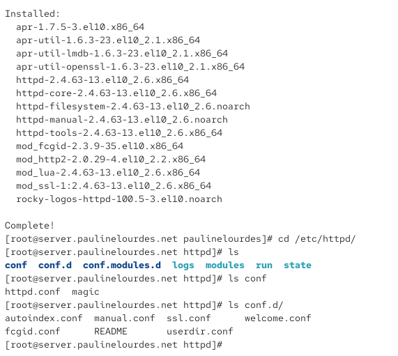{ #fig-001 width=70% }

Для обеспечения сетевого доступа к HTTP-серверу разрешаю соответствующий сервис в межсетевом экране. Команда `firewall-cmd --add-service=http` добавляет разрешение на HTTP-трафик в текущую конфигурацию `firewalld`, а команда `firewall-cmd --add-service=http --permanent` сохраняет это правило в постоянной конфигурации. В обоих случаях вывод `success` подтверждает успешное изменение настроек межсетевого экрана.

После настройки межсетевого экрана включаю автоматический запуск Apache командой `systemctl enable httpd`. При выполнении команды создаётся символическая ссылка в каталоге `multi-user.target.wants`, благодаря чему HTTP-сервер будет автоматически запускаться при загрузке системы. Затем запускаю сервер командой `systemctl start httpd` и проверяю его состояние с помощью `systemctl status httpd`.

В выводе состояния служба `httpd.service` имеет состояния `enabled` и `active (running)`. Сообщение `Started, listening on: port 443, port 80` показывает, что Apache успешно запущен и принимает соединения на стандартном HTTP-порту `80` и HTTPS-порту `443` (см. рис. [@fig-002]).

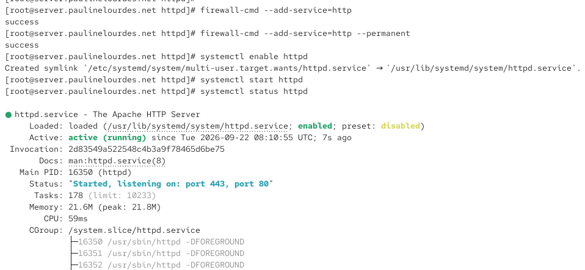{ #fig-002 width=70% }

Для проверки базовой конфигурации HTTP-сервера на виртуальной машине `client` открываю в веб-браузере адрес `http://192.168.1.1`. В браузере отображается стандартная страница `HTTP Server Test Page`, используемая в Rocky Linux для подтверждения корректной установки и запуска Apache. Появление данной страницы означает, что клиент имеет сетевой доступ к серверу, межсетевой экран пропускает HTTP-соединения, а Apache обрабатывает поступающие запросы (см. рис. [@fig-003]).

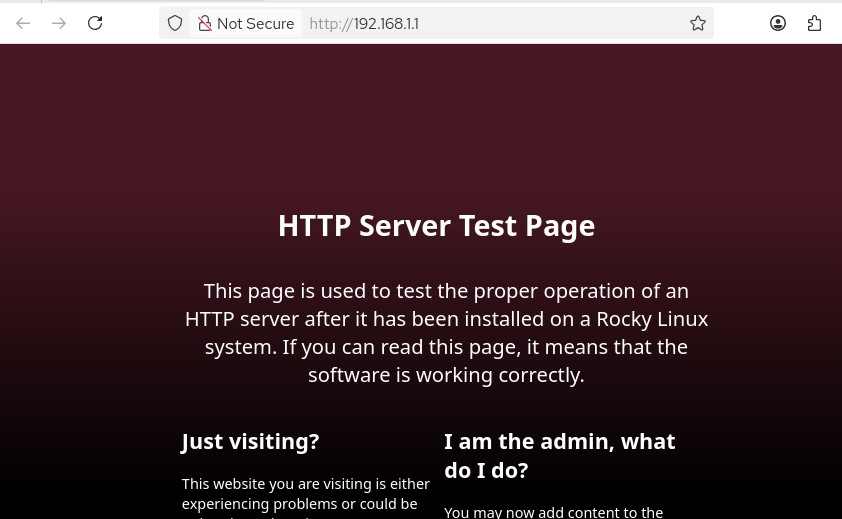{ #fig-003 width=70% }

Для анализа работы веб-сервера просматриваю журналы `/var/log/httpd/error_log` и `/var/log/httpd/access_log`. В журнале ошибок присутствуют служебные сообщения о запуске Apache, в том числе сведения о включённой политике SELinux и версии сервера `Apache/2.4.63 (Rocky Linux)`. Сообщение `resuming normal operations` указывает на переход веб-сервера в штатный режим работы.

После обращения клиента с адресом `192.168.1.30` к корневому каталогу сервера в журнале появляется сообщение `AH01276`, сообщающее об отсутствии файла `DirectoryIndex`, например `index.html`, в каталоге `/var/www/html/`. На данном этапе собственная стартовая страница ещё не создана, поэтому Apache использует стандартную конфигурацию приветственной страницы.

В журнале доступа фиксируются HTTP-запросы клиента. Запрос `GET / HTTP/1.1` возвращает код `403`, запросы к элементам стандартной страницы, например `/icons/poweredby.png` и `/poweredby.png`, возвращают код `200`, означающий успешную передачу ресурса. Запрос `/favicon.ico` получает код `404`, поскольку соответствующий файл отсутствует. В записях также отображаются IP-адрес клиента `192.168.1.30`, время обращения и строка `User-Agent` браузера Firefox. Журналы позволяют контролировать обработку HTTP-запросов и диагностировать ошибки веб-сервера (см. рис. [@fig-004]).

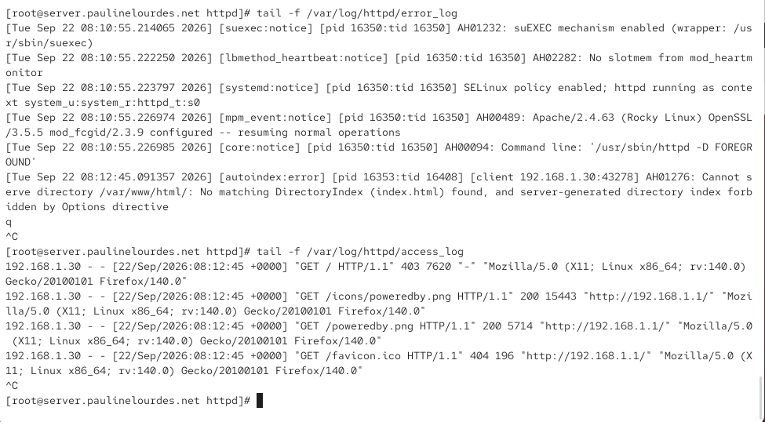{ #fig-004 width=70% }

Для настройки виртуального хостинга по доменным именам `server.paulinelourdes.net` и `www.paulinelourdes.net` вношу изменения в прямую DNS-зону `paulinelourdes.net`. Серийный номер зоны установлен в значение `2026092200`, соответствующее версии конфигурации DNS-зоны на момент выполнения работы.

В зоне уже присутствуют записи для узлов `dhcp`, `ns` и `server`, указывающие на адрес `192.168.1.1`. Добавляю запись типа `A` для имени `www`:

`www A 192.168.1.1`

После добавления данной записи имя `www.paulinelourdes.net` будет разрешаться DNS-сервером в IPv4-адрес `192.168.1.1`, на котором работает Apache. Имя `server.paulinelourdes.net` уже связано с этим же адресом соответствующей записью `server A 192.168.1.1` (см. рис. [@fig-005]).

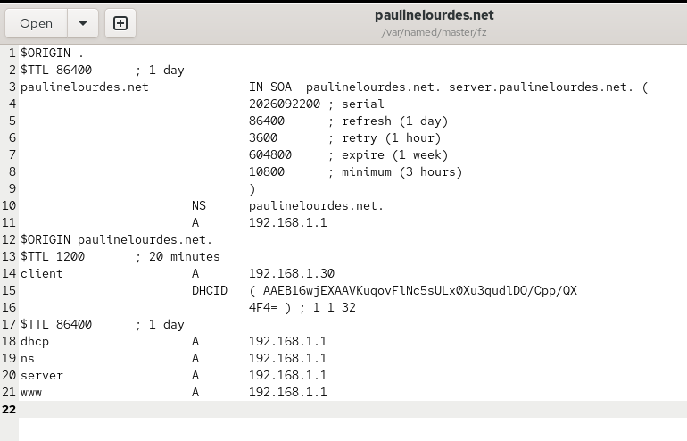{ #fig-005 width=70% }

Изменяю также файл обратной DNS-зоны сети `192.168.1.0/24`. Директива `$ORIGIN 1.168.192.in-addr.arpa.` определяет пространство имён обратной зоны. Для адреса `192.168.1.1` присутствуют PTR-записи для имён `server.paulinelourdes.net`, `ns.paulinelourdes.net` и `dhcp.paulinelourdes.net`.

Дополнительно создаю PTR-запись:

`1 PTR www.paulinelourdes.net.`

Она обеспечивает обратное преобразование IPv4-адреса `192.168.1.1` в доменное имя `www.paulinelourdes.net`. После внесения изменений DNS-сервер может использовать обновлённые прямую и обратную зоны для разрешения имён виртуальных HTTP-серверов (см. рис. [@fig-006]).

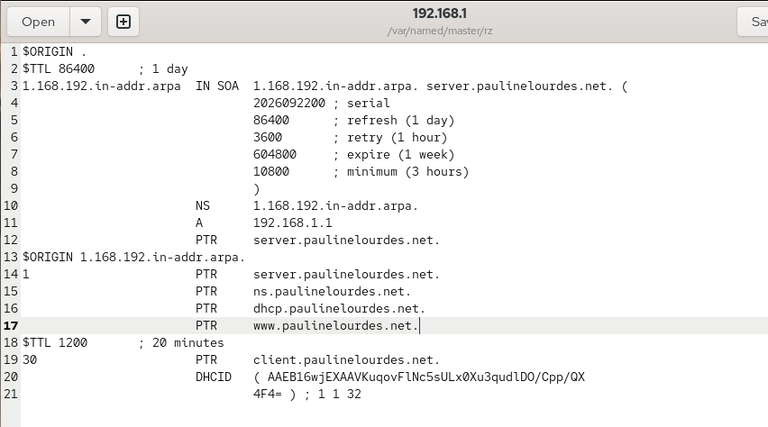{ #fig-006 width=70% }

После настройки DNS создаю в каталоге `/etc/httpd/conf.d` отдельный конфигурационный файл `server.paulinelourdes.net.conf` для первого виртуального хоста. Директива `<VirtualHost *:80>` указывает, что данный виртуальный сервер принимает HTTP-запросы на порту `80` на всех доступных сетевых интерфейсах.

Параметр `ServerAdmin webmaster@paulinelourdes.net` задаёт адрес администратора веб-сервера. В `DocumentRoot` указываю каталог `/var/www/html/server.paulinelourdes.net`, из которого будет передаваться содержимое сайта. Параметр `ServerName server.paulinelourdes.net` определяет DNS-имя виртуального хоста.

Для каждого виртуального сервера задаются отдельные журналы. Директива `ErrorLog logs/server.paulinelourdes.net-error_log` задаёт файл регистрации ошибок, а `CustomLog logs/server.paulinelourdes.net-access_log common` — журнал обращений к виртуальному хосту в формате `common` (см. рис. [@fig-007]).

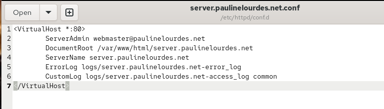{ #fig-007 width=70% }

Аналогично создаю конфигурационный файл `/etc/httpd/conf.d/www.paulinelourdes.net.conf` для второго виртуального хоста. В нём задаю имя `www.paulinelourdes.net` и отдельный корневой каталог `/var/www/html/www.paulinelourdes.net`.

Для регистрации ошибок используется файл `logs/www.paulinelourdes.net-error_log`, а запросы клиентов записываются в `logs/www.paulinelourdes.net-access_log`. Наличие отдельных `ServerName` позволяет Apache определить нужный виртуальный хост по значению HTTP-заголовка `Host`, несмотря на использование обоими сайтами одного IPv4-адреса `192.168.1.1` и одного порта `80` (см. рис. [@fig-008]).

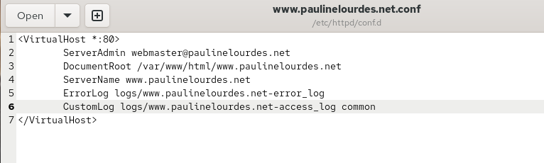{ #fig-008 width=70% }

Для проверки работы первого виртуального хоста создаю каталог `/var/www/html/server.paulinelourdes.net` и размещаю в нём файл `index.html`. В качестве тестового содержимого страницы записываю строку `Welcome to the server.paulinelourdes.net server`.

Поскольку данный каталог указан в параметре `DocumentRoot` виртуального хоста `server.paulinelourdes.net`, именно этот файл должен передаваться Apache при обращении клиента по соответствующему доменному имени (см. рис. [@fig-009]).

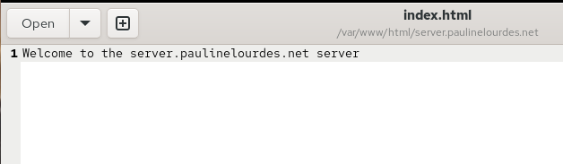{ #fig-009 width=70% }

Для второго виртуального сервера создаю каталог `/var/www/html/www.paulinelourdes.net` и файл `index.html`. В него записываю строку `Welcome to the www.paulinelourdes.net server`.

В результате каждый виртуальный хост получает отдельный каталог с веб-контентом и собственную стартовую страницу, что позволяет визуально проверить правильность выбора виртуального сервера Apache в зависимости от введённого DNS-имени (см. рис. [@fig-010]).

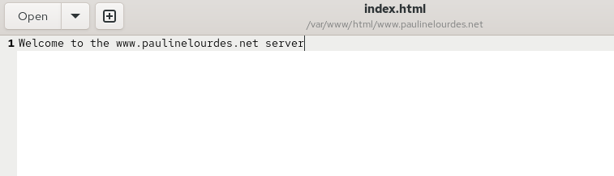{ #fig-010 width=70% }

После создания каталогов и файлов корректирую владельца веб-контента командой `chown -R apache:apache /var/www/`. В результате владельцем и группой файлов веб-сервера становится пользователь `apache`, от имени которого работает HTTP-сервер.

Затем восстанавливаю контексты безопасности SELinux командами `restorecon -vR /etc/`, `restorecon -vR /var/named/` и `restorecon -vR /var/www/`. Это необходимо после изменения конфигурационных файлов DNS и HTTP-сервера и создания новых каталогов с веб-контентом. Ключ `-R` обеспечивает рекурсивную обработку каталогов, а `-v` выводит информацию об изменяемых контекстах.

После завершения настройки выполняю `systemctl restart httpd`, чтобы Apache повторно загрузил конфигурацию, включая созданные файлы виртуальных хостов (см. рис. [@fig-011]).

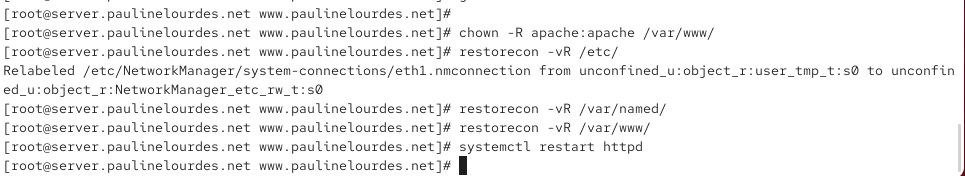{ #fig-011 width=70% }

На виртуальной машине `client` проверяю работу первого виртуального хоста. В адресной строке браузера открываю `http://server.paulinelourdes.net`. DNS-сервер преобразует данное имя в адрес `192.168.1.1`, после чего браузер отправляет HTTP-запрос с именем требуемого узла.

Apache сопоставляет значение имени с директивой `ServerName server.paulinelourdes.net` и использует каталог `/var/www/html/server.paulinelourdes.net`. В браузере появляется текст `Welcome to the server.paulinelourdes.net server`, совпадающий с содержимым созданного файла `index.html`. Это подтверждает корректную работу первого виртуального хоста (см. рис. [@fig-012]).

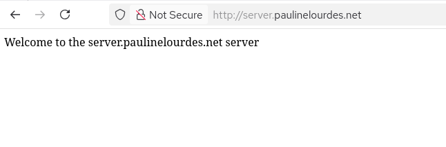{ #fig-012 width=70% }

Далее в браузере открываю адрес `http://www.paulinelourdes.net`. Запрос также направляется на узел `192.168.1.1`, однако по значению HTTP-заголовка `Host` Apache выбирает конфигурацию виртуального сервера `www.paulinelourdes.net` и каталог `/var/www/html/www.paulinelourdes.net`.

На странице отображается строка `Welcome to the www.paulinelourdes.net server`, взятая из второго файла `index.html`. Полученный результат подтверждает корректную работу виртуального хостинга по двум DNS-именам на одном IP-адресе (см. рис. [@fig-013]).

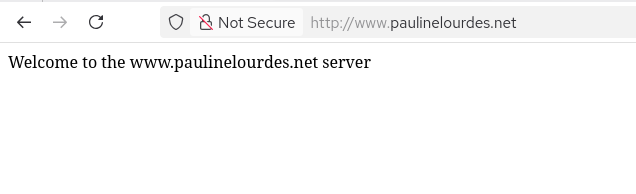{ #fig-013 width=70% }

Для автоматизации установки и настройки HTTP-сервера создаю файл `/vagrant/provision/server/http.sh`. В первой строке `#!/bin/bash` задаётся интерпретатор Bash. Команды `echo` выводят информацию о текущем этапе выполнения сценария.

Команда `dnf -y groupinstall "Basic Web Server"` автоматически устанавливает необходимую группу пакетов веб-сервера. После этого содержимое подготовленного каталога `/vagrant/provision/server/http/etc/httpd/` копируется в `/etc/httpd`, а файлы из `/vagrant/provision/server/http/var/www/` — в `/var/www`. За счёт этого при создании виртуальной машины автоматически восстанавливаются ранее подготовленные конфигурации виртуальных хостов и их веб-страницы.

Команда `chown -R apache:apache /var/www` устанавливает владельца веб-контента, после чего `restorecon -vR /etc` и `restorecon -vR /var/www` восстанавливают требуемые контексты SELinux.

Далее скрипт разрешает HTTP-трафик командами `firewall-cmd --add-service=http` и `firewall-cmd --add-service=http --permanent`. В заключительной части выполняются `systemctl enable httpd` и `systemctl start httpd`, за счёт чего HTTP-сервер включается в автозагрузку и запускается. Скрипт фиксирует основные действия, выполненные вручную при установке и конфигурировании Apache (см. рис. [@fig-014]).

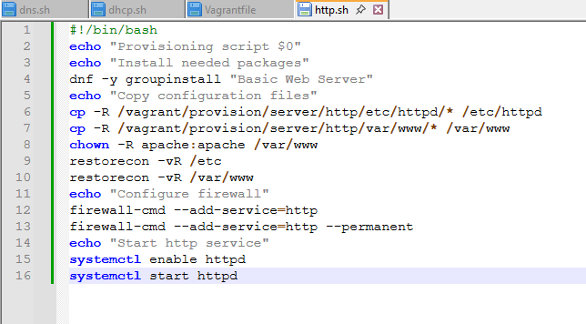{ #fig-014 width=70% }

Для выполнения созданного сценария при подготовке внутреннего окружения виртуальной машины `server` в файл `Vagrantfile` добавляю provision-блок с именем `server http`, типом `shell` и параметром `path: "provision/server/http.sh"`. Параметр `preserve_order: true` обеспечивает выполнение сценария в заданной последовательности относительно остальных provision-скриптов сервера. После этого при автоматизированном развёртывании виртуальной машины Vagrant может установить Apache, перенести подготовленные конфигурационные файлы, настроить права и SELinux, разрешить HTTP-трафик в межсетевом экране и запустить службу `httpd`.

# Вывод

В ходе лабораторной работы на виртуальной машине `server` был установлен и настроен HTTP-сервер Apache. Для установки использовалась группа пакетов `Basic Web Server`, включающая основной пакет `httpd`, служебные утилиты и дополнительные модули веб-сервера. После установки были рассмотрены основной конфигурационный файл `/etc/httpd/conf/httpd.conf` и дополнительные конфигурационные файлы из каталога `/etc/httpd/conf.d`.

Для обеспечения доступа к веб-серверу в межсетевом экране `firewalld` был разрешён сервис `http`. Служба `httpd` была добавлена в автозагрузку и запущена средствами `systemd`. Проверка состояния службы показала, что Apache находится в состоянии `active (running)` и принимает HTTP-соединения на стандартном порту `80`. Работоспособность базовой конфигурации была проверена с виртуальной машины `client` обращением к адресу `192.168.1.1`, после чего в браузере отобразилась стандартная тестовая страница Apache.

Для анализа работы HTTP-сервера были рассмотрены журналы `/var/log/httpd/error_log` и `/var/log/httpd/access_log`. В журнале ошибок отображались сообщения о запуске и работе Apache, а в журнале доступа фиксировались запросы клиента, запрашиваемые ресурсы и коды HTTP-ответов. Это позволило убедиться, что обращения с виртуальной машины `client` поступают на сервер и обрабатываются веб-сервером.

В рамках настройки виртуального хостинга были подготовлены два веб-сайта: `server.paulinelourdes.net` и `www.paulinelourdes.net`. Для имени `www.paulinelourdes.net` были добавлены соответствующие записи в прямую и обратную DNS-зоны. В каталоге `/etc/httpd/conf.d` созданы отдельные конфигурационные файлы виртуальных хостов, в которых заданы параметры `ServerName`, `DocumentRoot`, `ErrorLog` и `CustomLog`.

Для каждого виртуального хоста был создан отдельный каталог с веб-контентом: `/var/www/html/server.paulinelourdes.net` и `/var/www/html/www.paulinelourdes.net`. В каждом каталоге размещён собственный файл `index.html`. После настройки владельца файлов, восстановления контекстов SELinux и перезапуска `httpd` корректность виртуального хостинга была проверена с виртуальной машины `client`. При обращении к `server.paulinelourdes.net` и `www.paulinelourdes.net` браузер отображал содержимое соответствующих тестовых страниц.

Для автоматизации установки и настройки веб-сервера был подготовлен provisioning-сценарий `/vagrant/provision/server/http.sh`. Скрипт устанавливает необходимые пакеты, копирует конфигурационные файлы и веб-контент, устанавливает требуемые права доступа, восстанавливает контексты SELinux, настраивает `firewalld`, включает Apache в автозагрузку и запускает службу `httpd`. Для автоматического выполнения этого сценария при развёртывании виртуальной машины соответствующий provision-блок добавляется в файл `Vagrantfile`.

# Контрольные вопросы

1. Через какой порт по умолчанию работает Apache?

По умолчанию веб-сервер Apache для обычного протокола **HTTP** использует TCP-порт:

`80`

В конфигурационном файле Apache это определяется директивой:

`Listen 80`

Если на сервере настроен протокол **HTTPS**, используется TCP-порт:

`443`

При работе HTTPS соединение между клиентом и сервером защищается с помощью TLS. В выполненной лабораторной работе основной доступ к виртуальным хостам осуществлялся по протоколу HTTP через порт `80`.

2. Под каким пользователем запускается Apache и к какой группе относится этот пользователь?

В дистрибутивах семейства Red Hat, к которым относится Rocky Linux, рабочие процессы Apache выполняются от имени специального системного пользователя:

`apache`

и относятся к группе:

`apache`

В конфигурации `/etc/httpd/conf/httpd.conf` это задаётся параметрами:

`User apache`

`Group apache`

При запуске службы главный процесс Apache первоначально запускается с необходимыми системными привилегиями, поскольку для открытия привилегированного порта `80` требуются повышенные права. После выполнения необходимых операций рабочие процессы, непосредственно обслуживающие HTTP-запросы, работают с пониженными привилегиями от имени пользователя `apache`.

Использование отдельного непривилегированного пользователя повышает безопасность системы: при возникновении уязвимости в веб-приложении или HTTP-сервере потенциальный нарушитель не получает автоматически полномочия суперпользователя.

Проверить пользователя и группу можно, например, командами:

`ps aux | grep httpd`

`id apache`

3. Где располагаются лог-файлы веб-сервера? Что можно по ним отслеживать?

В Rocky Linux основные журналы Apache располагаются в каталоге:

`/var/log/httpd/`

Основными файлами являются:

`/var/log/httpd/access_log`

`/var/log/httpd/error_log`

Файл `access_log` содержит информацию об обращениях клиентов к веб-серверу. В нём можно отслеживать:

- IP-адрес клиента;
- дату и время запроса;
- метод HTTP-запроса, например `GET` или `POST`;
- адрес запрашиваемого ресурса;
- версию HTTP;
- код ответа сервера;
- объём переданных данных;
- при соответствующем формате журнала — сведения о браузере и странице-источнике запроса.

Например, код ответа `200` означает успешную обработку запроса, `403` — запрет доступа, а `404` — отсутствие запрошенного ресурса.

Файл `error_log` предназначен для регистрации сообщений о работе и ошибках Apache. По нему можно отслеживать:

- запуск и остановку службы;
- ошибки конфигурации;
- проблемы с правами доступа;
- отсутствие необходимых файлов;
- ошибки модулей Apache;
- проблемы при обработке запросов;
- сообщения, связанные с доступом к каталогам и файлам.

Просматривать журналы в режиме реального времени можно командами:

`tail -f /var/log/httpd/access_log`

`tail -f /var/log/httpd/error_log`

Для виртуальных хостов могут использоваться отдельные файлы журналов. Например, в выполненной работе для `server.paulinelourdes.net` были заданы:

`logs/server.paulinelourdes.net-error_log`

`logs/server.paulinelourdes.net-access_log`

а для `www.paulinelourdes.net`:

`logs/www.paulinelourdes.net-error_log`

`logs/www.paulinelourdes.net-access_log`

При стандартной конфигурации Apache относительный путь `logs/` связан с каталогом журналов веб-сервера `/var/log/httpd`.

4. Где по умолчанию содержится контент веб-серверов?

В стандартной конфигурации Apache в Rocky Linux основной каталог веб-контента расположен по адресу:

`/var/www/html`

Этот каталог является стандартным значением `DocumentRoot`. Файлы, расположенные в нём, могут передаваться клиентам при обращении к веб-серверу.

Например, основной файл веб-страницы обычно имеет имя:

`/var/www/html/index.html`

При использовании виртуального хостинга для каждого сайта можно определить отдельный каталог. В выполненной лабораторной работе использовались:

`/var/www/html/server.paulinelourdes.net`

и

`/var/www/html/www.paulinelourdes.net`

В конфигурации соответствующих виртуальных хостов эти каталоги задавались директивами:

`DocumentRoot /var/www/html/server.paulinelourdes.net`

и

`DocumentRoot /var/www/html/www.paulinelourdes.net`

Благодаря этому содержимое разных сайтов хранится раздельно, хотя сайты обслуживаются одним экземпляром Apache.

5. Каким образом реализуется виртуальный хостинг? Что он даёт?

Виртуальный хостинг позволяет одному HTTP-серверу обслуживать несколько веб-сайтов. В Apache для этого используются секции:

`<VirtualHost>`

Для каждого виртуального сайта можно создать отдельный конфигурационный файл в каталоге:

`/etc/httpd/conf.d/`

В выполненной работе использовались файлы:

`/etc/httpd/conf.d/server.paulinelourdes.net.conf`

`/etc/httpd/conf.d/www.paulinelourdes.net.conf`

В каждом виртуальном хосте задаются собственные параметры, например:

- `ServerName` — доменное имя сайта;
- `DocumentRoot` — каталог с веб-контентом;
- `ServerAdmin` — адрес администратора;
- `ErrorLog` — журнал ошибок;
- `CustomLog` — журнал обращений.

Например, для первого сайта используется:

`ServerName server.paulinelourdes.net`

`DocumentRoot /var/www/html/server.paulinelourdes.net`

а для второго:

`ServerName www.paulinelourdes.net`

`DocumentRoot /var/www/html/www.paulinelourdes.net`

В данной работе реализован **виртуальный хостинг по имени**. Оба доменных имени разрешаются в один IP-адрес `192.168.1.1` и используют один TCP-порт `80`. Когда браузер отправляет HTTP-запрос, он передаёт имя нужного сайта в заголовке `Host`. Apache анализирует это значение и выбирает соответствующую секцию `<VirtualHost>`.

Например, при запросе:

`http://server.paulinelourdes.net`

Apache выбирает виртуальный хост с параметром:

`ServerName server.paulinelourdes.net`

а при запросе:

`http://www.paulinelourdes.net`

используется конфигурация:

`ServerName www.paulinelourdes.net`

Виртуальный хостинг позволяет:

- размещать несколько сайтов на одном сервере;
- использовать для нескольких сайтов один IP-адрес;
- хранить контент каждого сайта в отдельном каталоге;
- использовать отдельные журналы доступа и ошибок;
- независимо настраивать параметры каждого сайта;
- эффективнее использовать вычислительные и сетевые ресурсы сервера.

За счёт виртуального хостинга один экземпляр Apache может одновременно обслуживать множество независимых доменных имён и веб-сайтов.