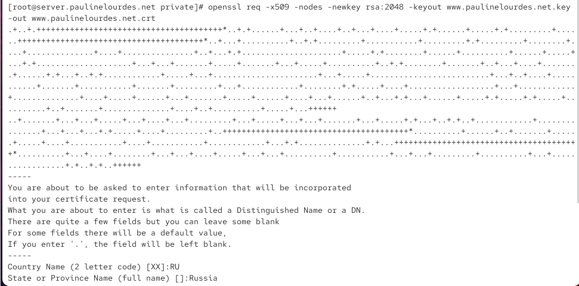
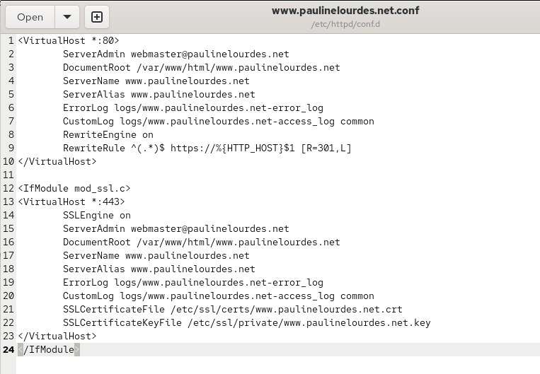
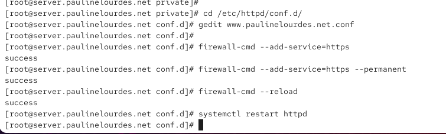
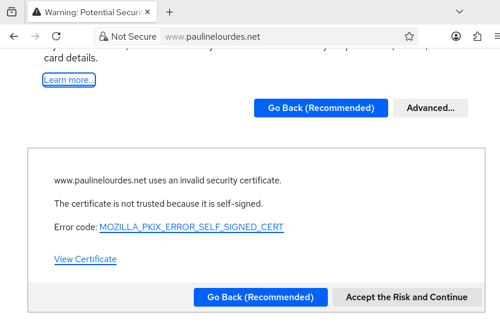
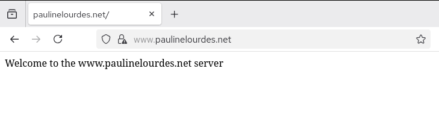
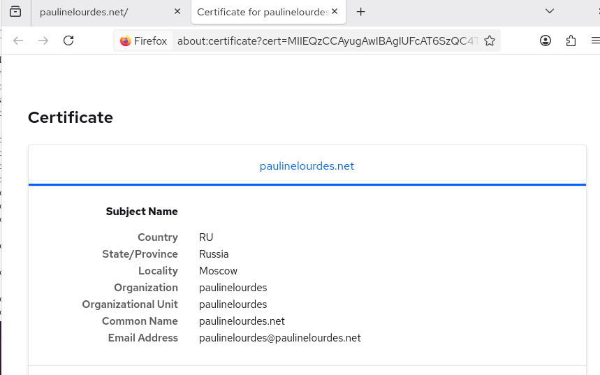
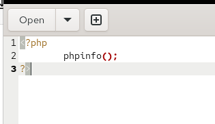
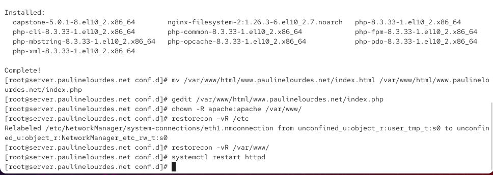
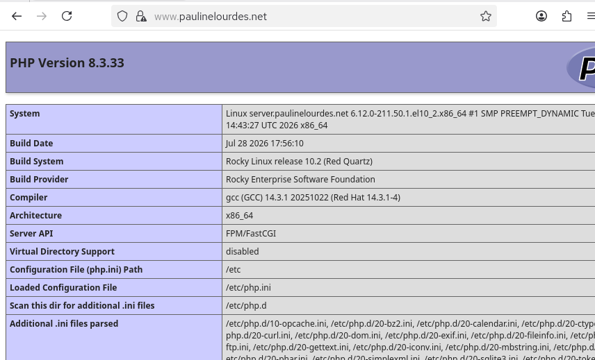
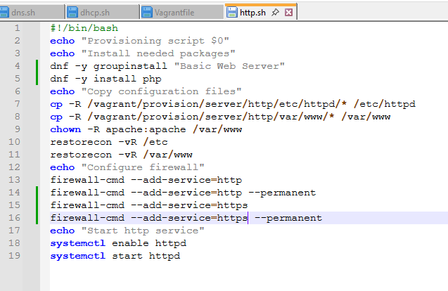

---
## Author
author:
  name: Камбунду Паулине Де Лоурдеш Бранку
  email: 1032239159@rudn.ru
  affiliation:
    - name: Российский университет дружбы народов
      country: Российская Федерация
      postal-code: 117198
      city: Москва
      address: ул. Миклухо-Маклая, д. 6

## Title
title: Лабораторная работа №5
subtitle: Расширенная настройка HTTP-сервера Apache
license: CC BY
date: today
date-format: "YYYY-MM-DD"
---

# Цели и задачи работы

## Цель лабораторной работы

Получение практических навыков расширенной настройки HTTP-сервера Apache: перехода на протокол HTTPS, создания самоподписанного сертификата, настройки PHP и автоматизации конфигурации веб-сервера.

# Процесс выполнения лабораторной работы

## Создаю ключ и сертификат безопасности

{ #fig:001 width=70% height=70% }

## Настраиваю виртуальный хост для HTTPS

{ #fig:002 width=70% height=70% }

## Разрешаю HTTPS в firewalld

{ #fig:003 width=70% height=70% }

## Проверяю самоподписанный сертификат

{ #fig:004 width=70% height=70% }

## Проверяю работу сайта по HTTPS

{ #fig:005 width=70% height=70% }

## Просматриваю сведения о сертификате

{ #fig:006 width=70% height=70% }

## Создаю PHP-страницу

{ #fig:007 width=70% height=70% }

## Настраиваю PHP, права доступа и SELinux

{ #fig:008 width=70% height=70% }

## Проверяю работу PHP

{ #fig:009 width=70% height=70% }

## Обновляю сценарий автоматической настройки

{ #fig:010 width=70% height=70% }

# Выводы по проделанной работе

## Вывод

В ходе лабораторной работы была выполнена расширенная настройка HTTP-сервера Apache на виртуальной машине `server`.

В результате веб-сервер Apache был настроен для защищённой работы по протоколу HTTPS, обработки PHP-сценариев и автоматического восстановления расширенной конфигурации при развёртывании виртуальной машины.
