---
## Author
author:
  name: Камбунду Паулине Де Лоурдеш Бранку
  email: 1032239159@rudn.ru
  affiliation:
    - name: Российский университет дружбы народов
      country: Российская Федерация
      postal-code: 117198
      city: Москва
      address: ул. Миклухо-Маклая, д. 6

## Title
title: Лабораторная работа №6
subtitle: Установка и настройка системы управления базами данных MariaDB
license: CC BY
date: today
date-format: "YYYY-MM-DD"
---

# Цели и задачи работы

## Цель лабораторной работы

Получение практических навыков установки и настройки системы управления базами данных MariaDB, настройки кодировки UTF-8, создания и администрирования базы данных, резервного копирования и восстановления данных, а также автоматизации конфигурации MariaDB средствами Vagrant.

# Процесс выполнения лабораторной работы

## Устанавливаю MariaDB и просматриваю конфигурацию

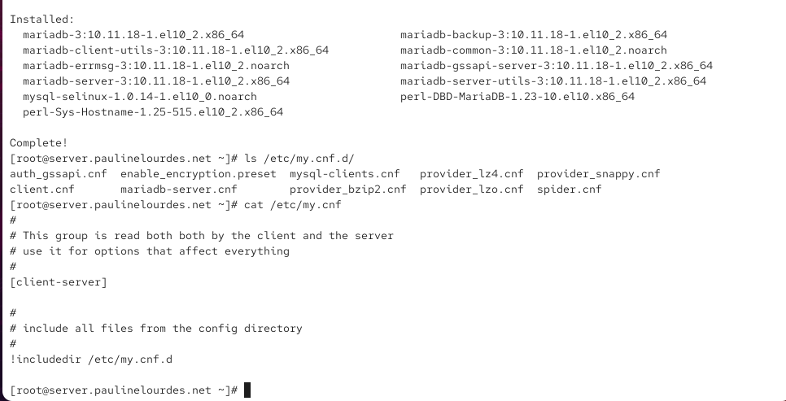{ #fig:001 width=70% height=70% }

## Запускаю MariaDB и проверяю порт

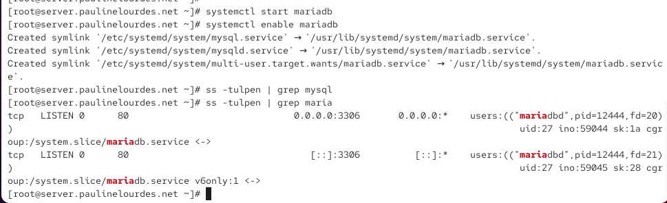{ #fig:002 width=70% height=70% }

## Настраиваю безопасность MariaDB

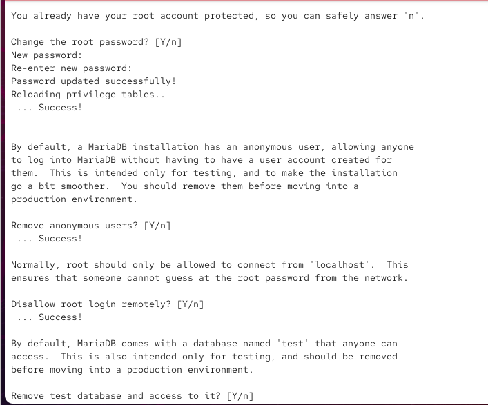{ #fig:003 width=70% height=70% }

## Просматриваю команды MariaDB

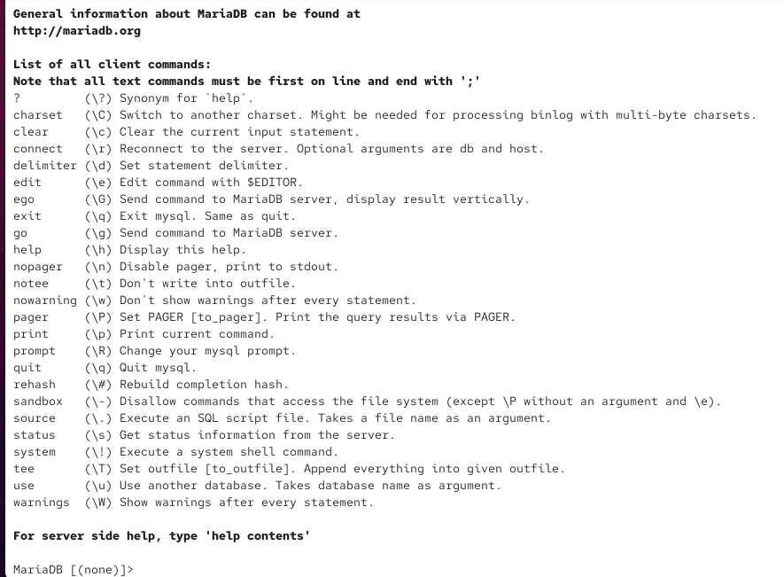{ #fig:004 width=70% height=70% }

## Просматриваю системные базы данных

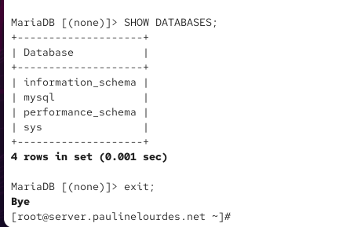{ #fig:005 width=70% height=70% }

## Проверяю исходную кодировку MariaDB

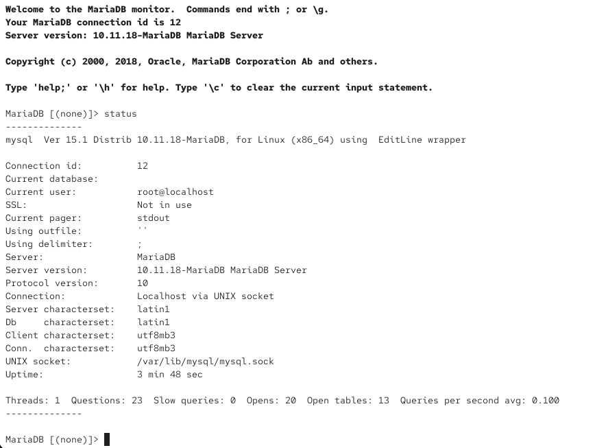{ #fig:006 width=70% height=70% }

## Настраиваю кодировку UTF-8

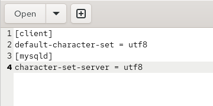{ #fig:007 width=70% height=70% }

## Проверяю изменение кодировки

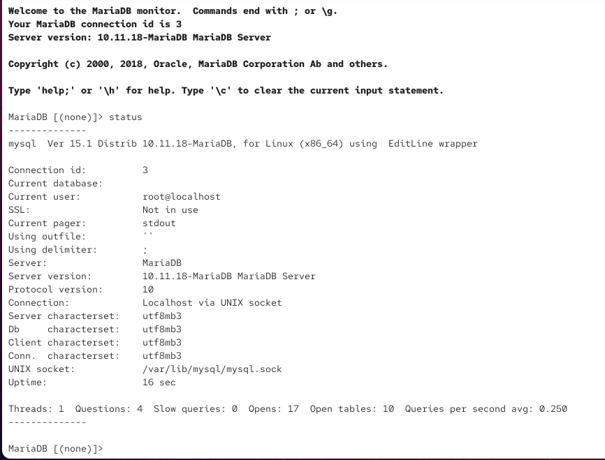{ #fig:008 width=70% height=70% }

## Создаю базу addressbook и таблицу city

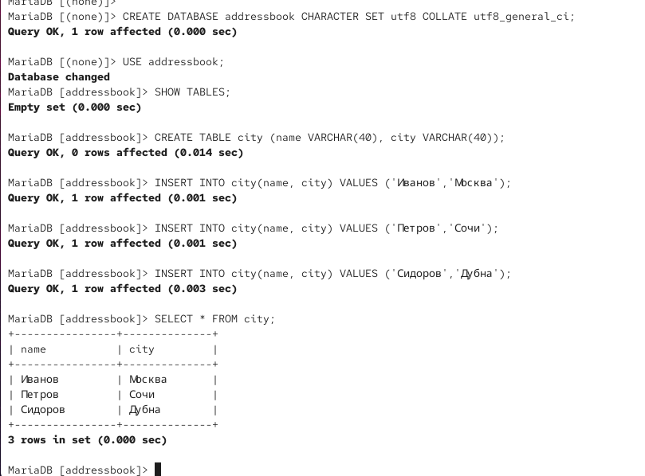{ #fig:009 width=70% height=70% }

## Создаю пользователя и назначаю права

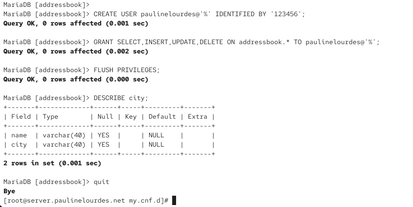{ #fig:010 width=70% height=70% }

## Проверяю базу данных с помощью mysqlshow

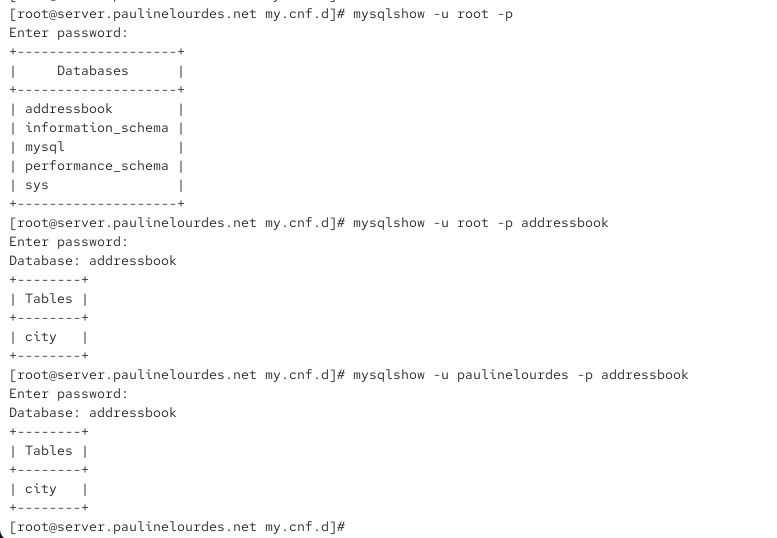{ #fig:011 width=70% height=70% }

## Создаю и восстанавливаю резервные копии

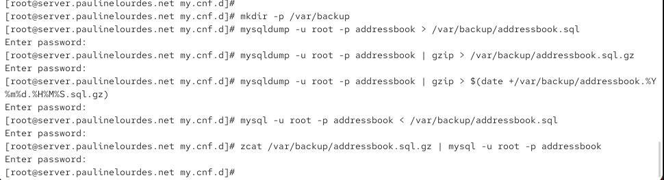{ #fig:012 width=70% height=70% }

## Автоматизирую настройку MariaDB

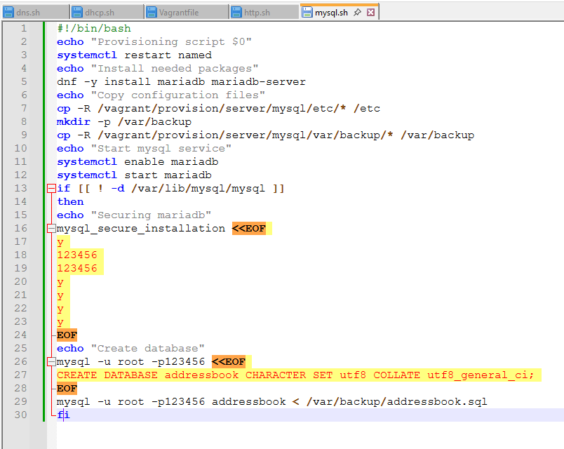{ #fig:013 width=70% height=70% }

# Выводы по проделанной работе

## Вывод

В ходе лабораторной работы была выполнена установка и настройка системы управления базами данных MariaDB на виртуальной машине `server`.

Была настроена безопасность MariaDB, установлена кодировка UTF-8, создана база данных `addressbook` с таблицей `city`, добавлены тестовые записи и настроены права отдельного пользователя.

Также были созданы и проверены резервные копии базы данных, включая сжатый вариант, и выполнено восстановление данных.
