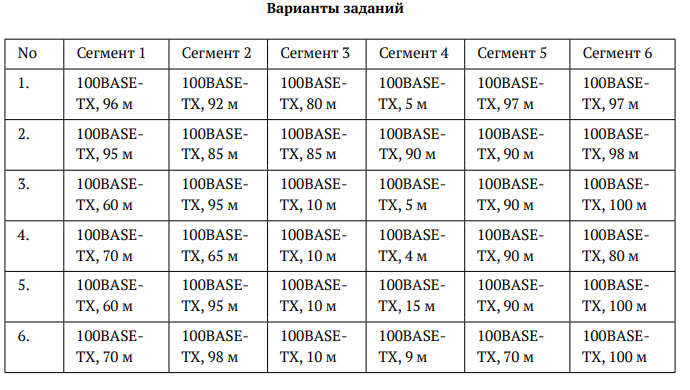
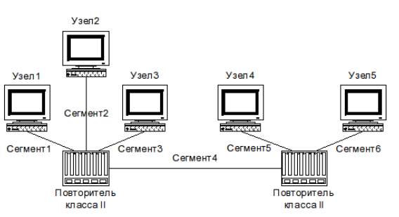

---
## Author
author:
  name: Камбунду Паулине Де Лоурдеш Бранку
  email: 1032239159@rudn.ru
  affiliation:
    - name: Российский университет дружбы народов
      country: Российская Федерация
      postal-code: 117198
      city: Москва
      address: ул. Миклухо-Маклая, д. 6

## Title
title: Домашняя работа №2
subtitle: Расчёт сети Fast Ethernet
license: CC BY
date: today
date-format: "YYYY-MM-DD"
---

# Цели и задачи работы

## Цель лабораторной работы

Изучение принципов технологий Ethernet и Fast Ethernet, а также практическое освоение методики оценки работоспособности сети Fast Ethernet по первой и второй моделям.

# Условие лабораторной работы

## Анализирую варианты задания

{ #fig:001 width=70% height=70% }

## Анализирую топологию сети

{ #fig:002 width=70% height=70% }

# Процесс выполнения лабораторной работы

## Проверяю вариант 1

Для варианта 1 наиболее длинный путь проходит через сегменты 1, 4 и 5 либо 1, 4 и 6.

Диаметр домена коллизий составляет 198 м, что меньше допустимых 205 м.

Время двойного оборота составляет 504,176 би, что меньше предельных 512 би.

Сеть варианта 1 работоспособна по обеим моделям.

## Проверяю вариант 2

Для варианта 2 наиболее длинный путь проходит через сегменты 1, 4 и 6.

Диаметр домена коллизий составляет 283 м, что превышает допустимые 205 м.

Время двойного оборота составляет 598,696 би, что превышает предельные 512 би.

Сеть варианта 2 неработоспособна по обеим моделям.

## Проверяю вариант 3

Для варианта 3 наиболее длинный путь проходит через сегменты 2, 4 и 6.

Диаметр домена коллизий составляет 200 м, что не превышает допустимые 205 м.

Время двойного оборота составляет 506,4 би, что меньше предельных 512 би.

Сеть варианта 3 работоспособна по обеим моделям.

## Проверяю вариант 4

Для варианта 4 наиболее длинный путь проходит через сегменты 1, 4 и 5.

Диаметр домена коллизий составляет 164 м, что меньше допустимых 205 м.

Время двойного оборота составляет 466,368 би, что меньше предельных 512 би.

Сеть варианта 4 работоспособна по обеим моделям.

## Проверяю вариант 5

Для варианта 5 наиболее длинный путь проходит через сегменты 2, 4 и 6.

Диаметр домена коллизий составляет 210 м, что превышает допустимые 205 м.

Время двойного оборота составляет 517,52 би, что превышает предельные 512 би.

Сеть варианта 5 неработоспособна по обеим моделям.

## Проверяю вариант 6

Для варианта 6 наиболее длинный путь проходит через сегменты 2, 4 и 6.

Диаметр домена коллизий составляет 207 м, что превышает допустимые 205 м.

Время двойного оборота составляет 514,184 би, что превышает предельные 512 би.

Сеть варианта 6 неработоспособна по обеим моделям.

# Выводы по проделанной работе

## Вывод

В ходе лабораторной работы была выполнена проверка сети Fast Ethernet по первой и второй моделям.

Установлено, что варианты 1, 3 и 4 удовлетворяют ограничениям по диаметру домена коллизий и времени двойного оборота сигнала, поэтому являются работоспособными.

Варианты 2, 5 и 6 превышают допустимые значения и требуют изменения конфигурации сети.