---
## Author
author:
  name: Камбунду Паулине Де Лоурдеш Бранку
  email: 1032239159@rudn.ru
  affiliation:
    - name: Российский университет дружбы народов
      country: Российская Федерация
      postal-code: 117198
      city: Москва
      address: ул. Миклухо-Маклая, д. 6

## Title
title: "Отчёт по домашней работе №3"
subtitle: "Анализ трафика в Wireshark"
license: "CC BY"
---

# Цель работы

Изучение посредством Wireshark кадров Ethernet, анализ PDU протоколов транспортного и прикладного уровней стека TCP/IP.

# Выполнение лабораторной работы

## 11.3.1. MAC-адресация

Для получения информации о текущей сетевой конфигурации в операционной системе Windows использую команду `ipconfig`. В стандартном режиме команда выводит основные параметры сетевых интерфейсов: IPv4- и IPv6-адреса, маску подсети и основной шлюз.

На компьютере присутствуют два Ethernet-интерфейса. Интерфейс `Ethernet 2` имеет IPv4-адрес `192.168.56.1` и маску подсети `255.255.255.0`, что соответствует префиксу `/24`. Основной шлюз для данного интерфейса отсутствует. Также интерфейсу назначен локальный IPv6-адрес канала `fe80::c080:3353:3af3:6fc8%18`. Адреса диапазона `fe80::/10` являются link-local IPv6-адресами и используются для взаимодействия в пределах одного сетевого сегмента. Значение после символа `%` обозначает индекс сетевого интерфейса в Windows.

Интерфейс `Ethernet 3` имеет IPv4-адрес `10.21.58.50`, маску `255.255.255.0` и основной шлюз `10.21.58.106`. Следовательно, именно этот интерфейс используется для обмена данными с другими сетями. Для него также назначен локальный IPv6-адрес `fe80::2658:cf7e:27cd:6a8a%55` (см. рис. [@fig-001]).

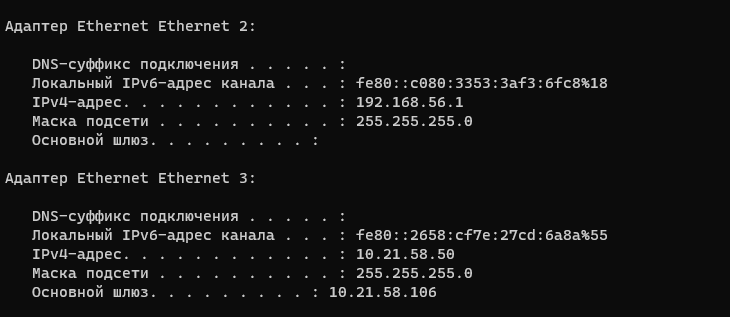{ #fig-001 width=70% }

Для получения расширенной информации использую команду `ipconfig /all`. В отличие от обычной команды `ipconfig`, данный вариант дополнительно выводит описание сетевого адаптера, физический адрес, состояние DHCP и автонастройки, сведения об аренде адреса, адреса DHCP- и DNS-серверов, а также другие параметры сетевого интерфейса.

Интерфейс `Ethernet 2` определяется как `VirtualBox Host-Only Ethernet Adapter`. Его физический, то есть MAC-адрес, имеет значение `0A-00-27-00-00-12`. DHCP для данного интерфейса отключён, а автонастройка включена. IPv4-адрес `192.168.56.1` назначен интерфейсу с маской `255.255.255.0`. Отсутствие основного шлюза соответствует назначению Host-Only-интерфейса VirtualBox: он используется для связи основной системы с виртуальными машинами внутри локального виртуального сегмента и не обязан обеспечивать маршрутизацию во внешнюю сеть.

Активный интерфейс `Ethernet 3` определяется как `Remote NDIS Compatible Device`. Его MAC-адрес равен `12-A3-EF-62-D1-5B`. Для интерфейса включён DHCP, IPv4-адрес `10.21.58.50` получен динамически. Маска подсети равна `255.255.255.0`, основной шлюз — `10.21.58.106`. В качестве DHCP-сервера и DNS-сервера также используется узел `10.21.58.106`. В выводе дополнительно указаны время получения и время окончания аренды IPv4-адреса. Следовательно, узел `10.21.58.106` выполняет для данного подключения сразу несколько функций: является шлюзом по умолчанию, DHCP-сервером и DNS-сервером (см. рис. [@fig-002]).

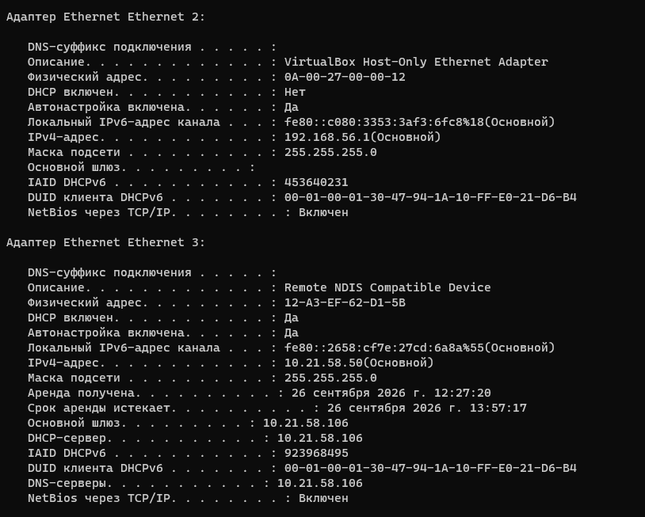{ #fig-002 width=70% }

MAC-адрес Ethernet представляет собой 48-битное значение, состоящее из шести октетов. В традиционной структуре глобально назначенного MAC-адреса первые 24 бита, то есть первые три октета, образуют идентификатор организации OUI (`Organizationally Unique Identifier`), назначаемый производителю сетевого оборудования. Последние 24 бита используются производителем для идентификации конкретного сетевого интерфейса.

Для адреса `0A-00-27-00-00-12` первые три октета имеют вид `0A-00-27`, а последние три — `00-00-12`. Для адреса `12-A3-EF-62-D1-5B` первые три октета имеют вид `12-A3-EF`, а последние три — `62-D1-5B`. Однако оба обнаруженных адреса являются локально администрируемыми, поэтому первые 24 бита в данном случае нельзя корректно интерпретировать как глобально назначенный производителю OUI. Принадлежность первого интерфейса VirtualBox устанавливается из поля описания адаптера `VirtualBox Host-Only Ethernet Adapter`, а не из его MAC-адреса.

Тип MAC-адреса определяется по двум младшим битам первого октета. Младший бит `I/G` (`Individual/Group`) показывает, является адрес индивидуальным или групповым. Значение `0` соответствует индивидуальному unicast-адресу, а значение `1` — групповому адресу. Следующий бит `U/L` (`Universal/Local`) определяет способ администрирования: `0` соответствует глобально администрируемому адресу, а `1` — локально администрируемому.

Для MAC-адреса `0A-00-27-00-00-12` первый октет `0A₁₆` имеет двоичное представление `00001010₂`. Его младший бит равен `0`, поэтому адрес является индивидуальным, то есть unicast. Второй младший бит равен `1`, следовательно, адрес локально администрируемый.

Для MAC-адреса `12-A3-EF-62-D1-5B` первый октет `12₁₆` имеет двоичное представление `00010010₂`. Здесь младший бит также равен `0`, а второй младший бит — `1`. Следовательно, этот MAC-адрес также является индивидуальным и локально администрируемым. Данный результат далее подтверждается Wireshark, который для адреса `12:a3:ef:62:d1:5b` непосредственно указывает `LG bit: Locally administered address` и `IG bit: Individual address (unicast)`.

## 11.3.2. Анализ кадров канального уровня в Wireshark

Для анализа кадров устанавливаю и запускаю Wireshark. Захват сетевого трафика выполняю на активном интерфейсе `Ethernet 3`, которому назначен IPv4-адрес `10.21.58.50`. Из результатов `ipconfig` было установлено, что основным шлюзом данного интерфейса является `10.21.58.106`.

Для проверки связи со шлюзом выполняю команду `ping 10.21.58.106`. Отправлено четыре ICMP Echo Request, на каждый из которых получен ICMP Echo Reply. Размер поля данных каждого сообщения составляет 32 байта. Все четыре ответа поступили менее чем за `1 мс`, количество потерянных пакетов равно нулю, а значение `TTL` полученных ответов составляет `64`. Успешное получение всех четырёх ответов подтверждает доступность шлюза `10.21.58.106` с локального узла `10.21.58.50` (см. рис. [@fig-003]).

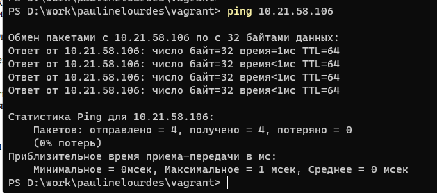{ #fig-003 width=70% }

После выполнения `ping` останавливаю захват и применяю в Wireshark фильтр отображения `arp or icmp`. В результате в списке остаются только кадры ARP и пакеты ICMP. Для анализа ICMP Echo Request выбираю кадр № 34.

Длина кадра составляет `74 байта`, или `592 бита`. На канальном уровне используется формат `Ethernet II`. В заголовке Ethernet II MAC-адресом источника является `12:a3:ef:62:d1:5b`, то есть MAC-адрес интерфейса `Ethernet 3`. MAC-адрес назначения — `3a:a3:2b:ce:b3:84`, принадлежащий шлюзу. Поле `Type` содержит значение `IPv4 (0x0800)`, поэтому полезная нагрузка Ethernet представляет собой пакет IPv4.

Wireshark показывает для обоих MAC-адресов признаки `Locally administered address` и `Individual address (unicast)`. Для локального адреса первый октет `12₁₆ = 00010010₂`, а для адреса шлюза `3A₁₆ = 00111010₂`. В обоих случаях младший бит равен `0`, а второй младший бит равен `1`. Следовательно, оба адреса индивидуальные и локально администрируемые.

На сетевом уровне исходным IP-адресом является `10.21.58.50`, адресом назначения — `10.21.58.106`. Значение `TTL` исходящего IPv4-пакета равно `128`. В заголовке ICMP указано `Type: Echo (ping) request (8)` и `Code: 0`. Идентификатор равен `1`, номер последовательности — `17`, а объём данных ICMP составляет `32 байта` (см. рис. [@fig-004]).

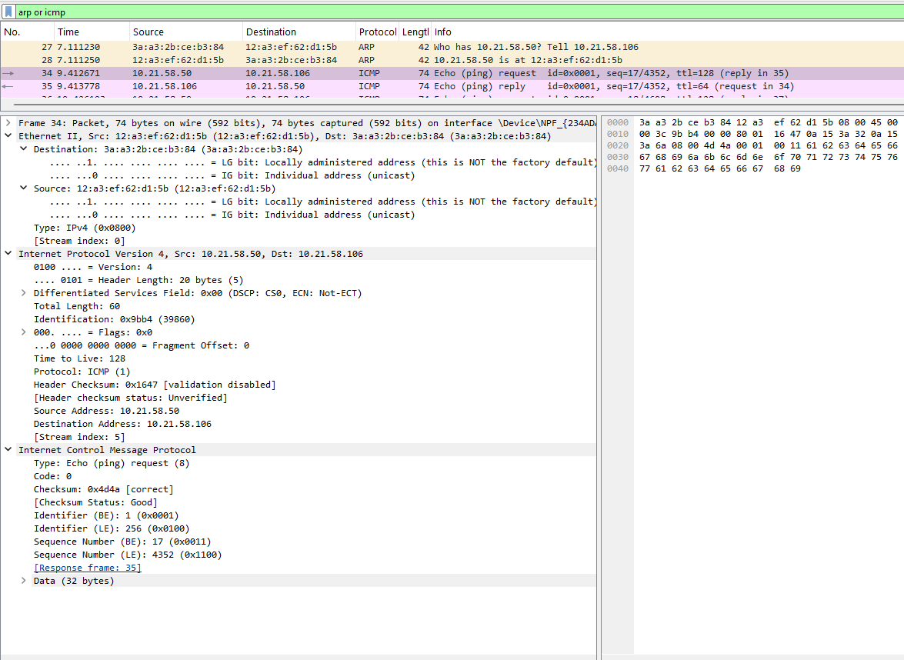{ #fig-004 width=70% }

Для анализа ответа выбираю кадр № 35. Его длина также составляет `74 байта`. Используется кадр `Ethernet II`, но направления MAC-адресов меняются местами: источником является шлюз с MAC-адресом `3a:a3:2b:ce:b3:84`, а получателем — локальный интерфейс `12:a3:ef:62:d1:5b`.

На уровне IPv4 исходным адресом становится `10.21.58.106`, а адресом назначения — `10.21.58.50`. Значение `TTL` полученного пакета равно `64`. ICMP-сообщение имеет `Type: Echo (ping) reply (0)` и `Code: 0`. Значения идентификатора и номера последовательности соответствуют запросу: `Identifier = 1`, `Sequence Number = 17`. Wireshark связывает кадр ответа с запросом № 34 и показывает время между ними около `1,107 мс`. Совпадение идентификатора и номера последовательности позволяет однозначно сопоставить ICMP Echo Reply с отправленным Echo Request (см. рис. [@fig-005]).

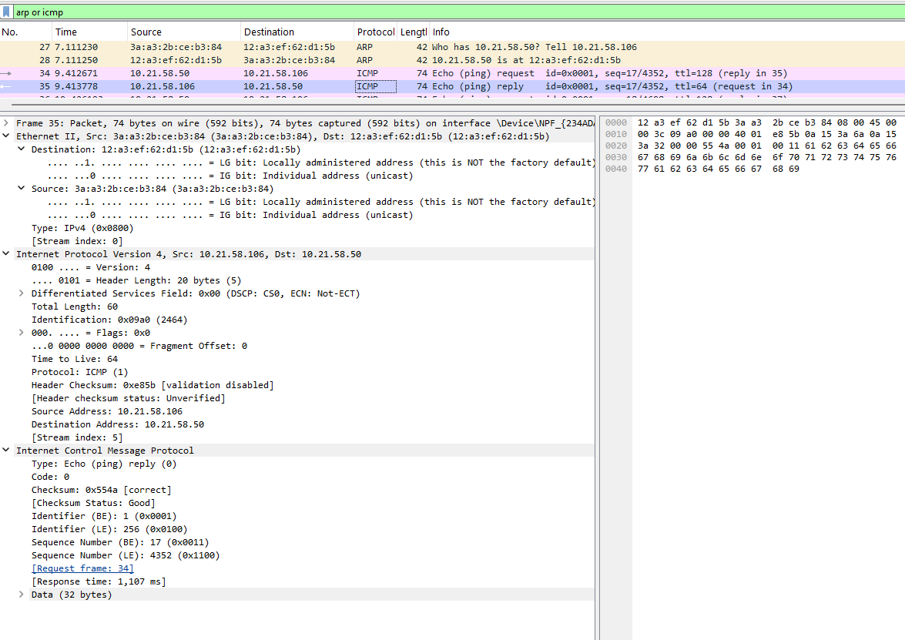{ #fig-005 width=70% }

Далее изучаю работу протокола ARP. В кадре № 27 находится ARP-запрос `Who has 10.21.58.50? Tell 10.21.58.106`. Длина кадра равна `42 байтам`. В заголовке `Ethernet II` источником является MAC-адрес шлюза `3a:a3:2b:ce:b3:84`, а получателем — `12:a3:ef:62:d1:5b`. Поле типа Ethernet содержит `ARP (0x0806)`.

В заголовке ARP указано `Hardware type: Ethernet (1)` и `Protocol type: IPv4 (0x0800)`. Размер аппаратного адреса составляет `6 байт`, а сетевого IPv4-адреса — `4 байта`. Значение `Opcode: request (1)` определяет сообщение как ARP-запрос. Поля отправителя содержат MAC-адрес `3a:a3:2b:ce:b3:84` и IP-адрес `10.21.58.106`. Искомому узлу соответствует IP-адрес `10.21.58.50`, а поле `Target MAC address` внутри ARP пока заполнено нулями `00:00:00:00:00:00`, поскольку именно MAC-адрес владельца IP `10.21.58.50` требуется определить. В рассматриваемом захвате сам Ethernet-кадр запроса передан непосредственно на MAC-адрес `12:a3:ef:62:d1:5b` (см. рис. [@fig-006]).

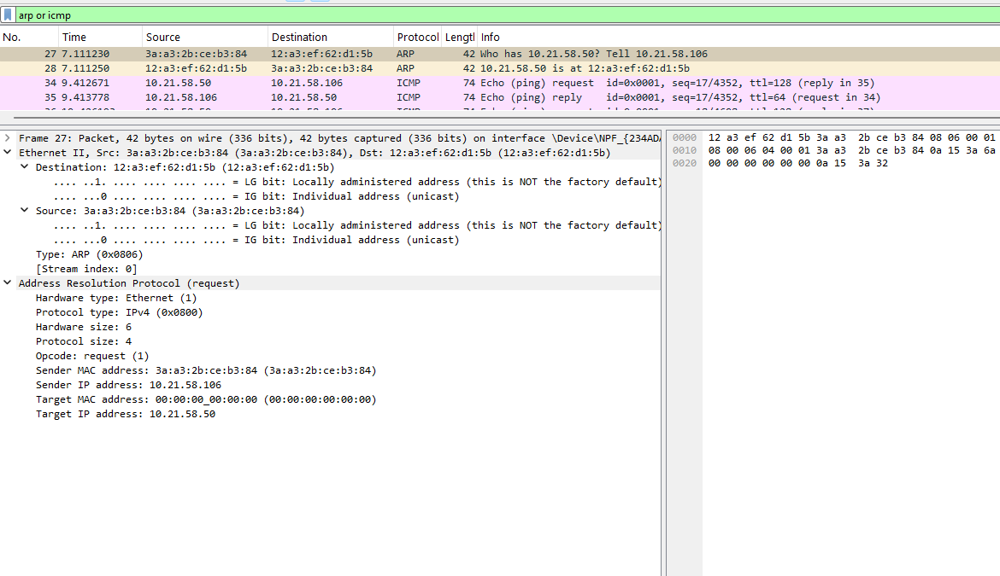{ #fig-006 width=70% }

В следующем кадре № 28 находится ARP-ответ. Его длина также составляет `42 байта`. Направление передачи изменяется: Ethernet-источник — `12:a3:ef:62:d1:5b`, а Ethernet-получатель — `3a:a3:2b:ce:b3:84`. Значение `Opcode: reply (2)` указывает на ARP Reply.

В полях ARP отправителем указан узел `10.21.58.50` с MAC-адресом `12:a3:ef:62:d1:5b`, а получателем — `10.21.58.106` с MAC-адресом `3a:a3:2b:ce:b3:84`. Следовательно, ARP-обмен устанавливает соответствие между IPv4-адресом `10.21.58.50` и физическим адресом `12:a3:ef:62:d1:5b` (см. рис. [@fig-007]).

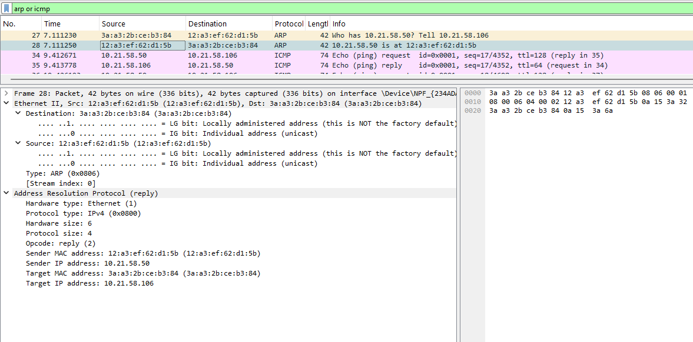{ #fig-007 width=70% }

Для анализа передачи ICMP к узлу за пределами локальной сети запускаю новый захват и выполняю команду `ping yandex.ru`. DNS-разрешение имени возвращает IPv4-адрес `5.255.255.77`. Отправлено четыре запроса по 32 байта, все четыре ответа успешно получены. Потери составляют `0%`. Время ответа составляет `19`, `39`, `27` и `23 мс`, среднее значение — `27 мс`. Значение `TTL` полученных сообщений равно `50` (см. рис. [@fig-008]).

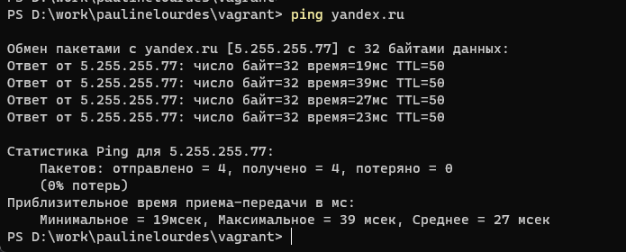{ #fig-008 width=70% }

После применения фильтра `arp or icmp` выбираю ICMP Echo Request № 56. Длина кадра равна `74 байтам`. На сетевом уровне пакет передаётся от `10.21.58.50` к удалённому адресу `5.255.255.77`. ICMP имеет тип `Echo request (8)`, код `0`, идентификатор `1`, номер последовательности `21`, размер данных `32 байта`, а исходное значение `TTL` равно `128`.

Особенностью данного кадра является различие между адресацией сетевого и канального уровней. IP-адресом назначения является удалённый сервер `5.255.255.77`, однако MAC-адресом назначения в локальном Ethernet-сегменте является не физический адрес удалённого сервера, а MAC-адрес шлюза `3a:a3:2b:ce:b3:84`. Источником Ethernet-кадра является локальный MAC-адрес `12:a3:ef:62:d1:5b`. Это связано с тем, что MAC-адреса действуют только в пределах текущего канального сегмента. Для отправки пакета во внешнюю сеть компьютер передаёт кадр ближайшему маршрутизатору, после чего на следующих участках маршрута формируются новые канальные заголовки (см. рис. [@fig-009]).

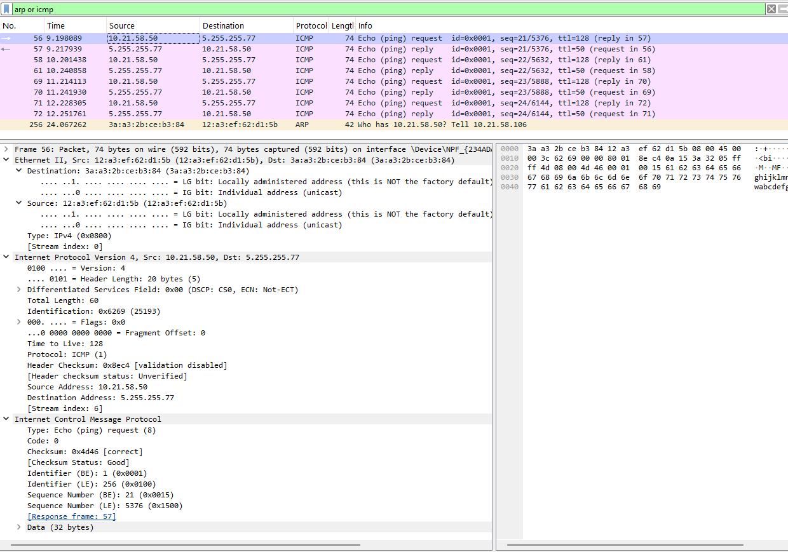{ #fig-009 width=70% }

В кадре № 57 содержится ответ от `5.255.255.77`. На IP-уровне источником является `5.255.255.77`, а получателем — `10.21.58.50`. ICMP имеет тип `Echo reply (0)`, код `0`, идентификатор `1` и номер последовательности `21`. Wireshark связывает его с запросом № 56, а измеренное время ответа составляет приблизительно `19,850 мс`. Значение `TTL` равно `50`.

На канальном уровне кадр приходит от шлюза `3a:a3:2b:ce:b3:84` на интерфейс компьютера `12:a3:ef:62:d1:5b`. Следовательно, даже для ответа от удалённого сервера на локальном участке сети виден MAC-адрес маршрутизатора, а не MAC-адрес сервера `5.255.255.77`. Оба видимых MAC-адреса являются индивидуальными и локально администрируемыми (см. рис. [@fig-010]).

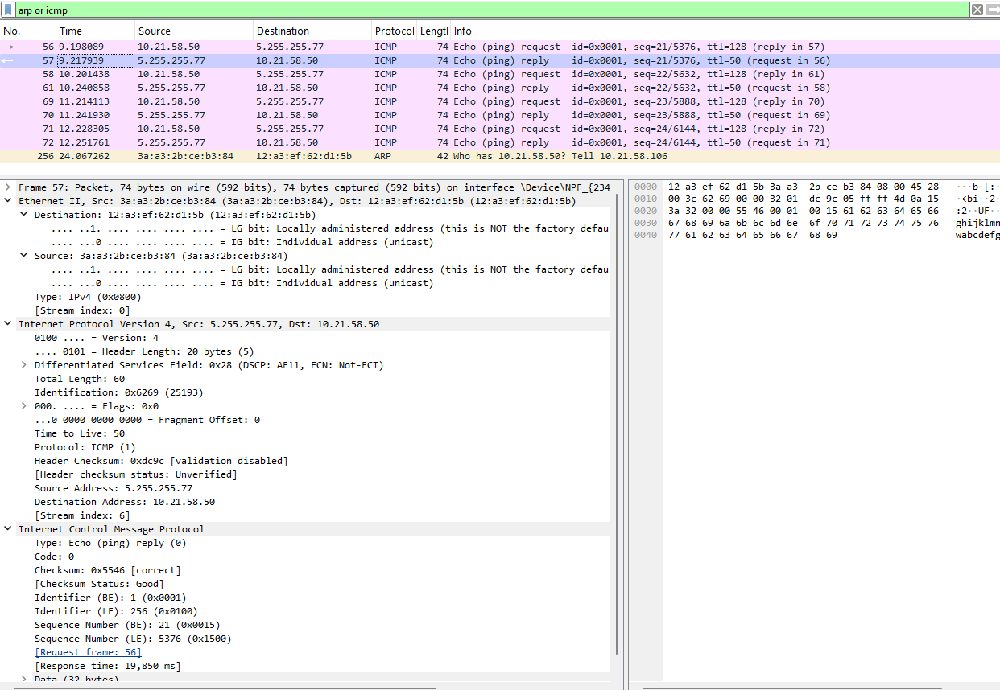{ #fig-010 width=70% }

## 11.3.3. Анализ протоколов транспортного уровня в Wireshark

Для исследования протокола HTTP запускаю захват трафика и открываю в браузере HTTP-сайт CERN. После выполнения запросов применяю в Wireshark фильтр `http`. В списке отображаются HTTP-запросы от локального узла `10.21.58.50` к серверу `188.184.67.127` и ответы сервера.

В частности, видны запросы `GET /apple-touch-icon.png HTTP/1.1`, `GET / HTTP/1.1` и `GET /favicon.ico HTTP/1.1`. Для первого ресурса сервер возвращает ответ `HTTP/1.1 404 Not Found`, для корневой страницы — `HTTP/1.1 200 OK (text/html)`, а для `favicon.ico` — `HTTP/1.1 200 OK`.

В кадре № 357 находится запрос `GET / HTTP/1.1`. IPv4-пакет направляется от `10.21.58.50` к `188.184.67.127`. HTTP работает поверх TCP. Исходный TCP-порт равен `50359`, порт назначения — стандартный HTTP-порт `80`. В данном TCP-сегменте относительный `Sequence Number` равен `1`, `Acknowledgment Number` равен `1`, а длина TCP-полезной нагрузки составляет `443 байта`. Установлены флаги `PSH` и `ACK`, то есть сегмент содержит прикладные данные и одновременно подтверждает ранее полученные данные. Следующий ожидаемый номер последовательности равен `444`, поскольку после байта с номером `1` передаются ещё `443` байта данных (см. рис. [@fig-011]).

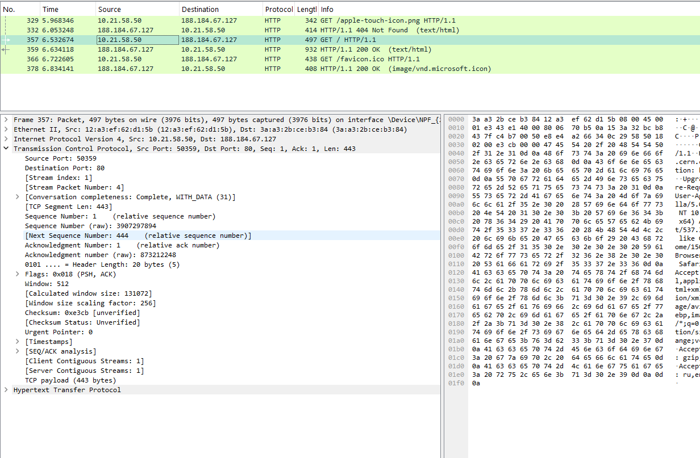{ #fig-011 width=70% }

Ответ сервера представлен кадром № 359. Источником является `188.184.67.127`, получателем — `10.21.58.50`. На транспортном уровне сервер использует исходный порт `80`, а портом назначения является клиентский порт `50359`. Относительный номер последовательности сервера равен `1`, а `Acknowledgment Number` равен `444`, что подтверждает получение клиентского TCP-сегмента с `443` байтами полезных данных. Длина полезной нагрузки TCP в ответе составляет `878 байт`, поэтому следующий относительный номер последовательности равен `879`.

В HTTP-части кадра содержится статус `HTTP/1.1 200 OK` и HTML-данные страницы. Флаги TCP снова имеют значения `PSH, ACK`. Данный обмен демонстрирует надёжность TCP: принимающая сторона подтверждает полученные байты посредством поля `Acknowledgment Number`, а последовательность байтов контролируется полем `Sequence Number` (см. рис. [@fig-012]).

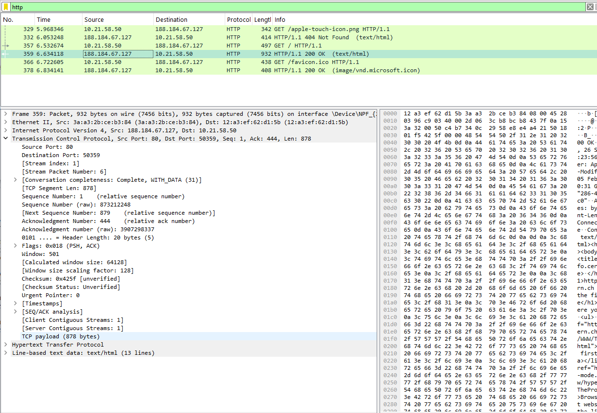{ #fig-012 width=70% }

Для исследования DNS применяю фильтр `dns`. В захвате присутствуют DNS-запросы от локального узла `10.21.58.50` к DNS-серверу `10.21.58.106`. В частности, браузер выполняет разрешение имени `home.web.cern.ch`.

В кадре № 393 находится DNS-запрос. В отличие от HTTP, рассматриваемый DNS-обмен выполняется поверх UDP. Исходным UDP-портом клиента является временный порт `55002`, а портом назначения — стандартный DNS-порт `53`. Длина полезной нагрузки UDP составляет `34 байта`. В заголовке DNS используется идентификатор транзакции `0xe158`, установлен флаг `Standard query`, количество запросов `Questions` равно `1`, а количество ответов в запросе равно нулю. В данном случае выполняется запрос DNS-записи типа `HTTPS` для имени `home.web.cern.ch`.

UDP не выполняет предварительное установление соединения и не использует номера последовательности и подтверждения, характерные для TCP. Соответствие DNS-запроса и DNS-ответа обеспечивается, в частности, идентификатором транзакции DNS (см. рис. [@fig-013]).

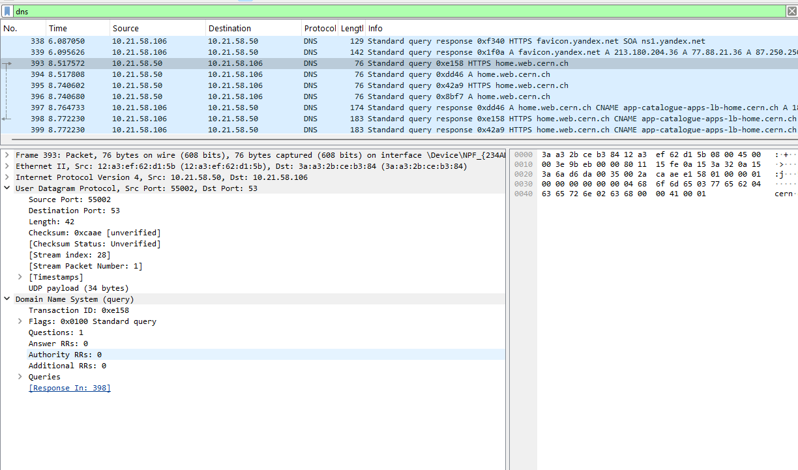{ #fig-013 width=70% }

Ответ на запрос находится в кадре № 398. Источником является DNS-сервер `10.21.58.106`, получателем — `10.21.58.50`. Исходный UDP-порт равен `53`, а порт назначения — `55002`, то есть значения портов относительно запроса меняются местами. UDP-пакет содержит `141 байт` полезной нагрузки.

Идентификатор DNS-транзакции остаётся равным `0xe158`, благодаря чему ответ связывается с кадром № 393. Флаги имеют значение `0x8180`, а Wireshark интерпретирует их как `Standard query response, No error`, то есть запрос обработан без ошибки. В ответе содержится одна запись в разделе `Answers` и одна запись в разделе `Authority`. Для `home.web.cern.ch` в списке пакетов также отображается CNAME `app-catalogue-apps-lb-home.cern.ch`. Время между запросом и выбранным ответом составляет приблизительно `254,658 мс` (см. рис. [@fig-014]).

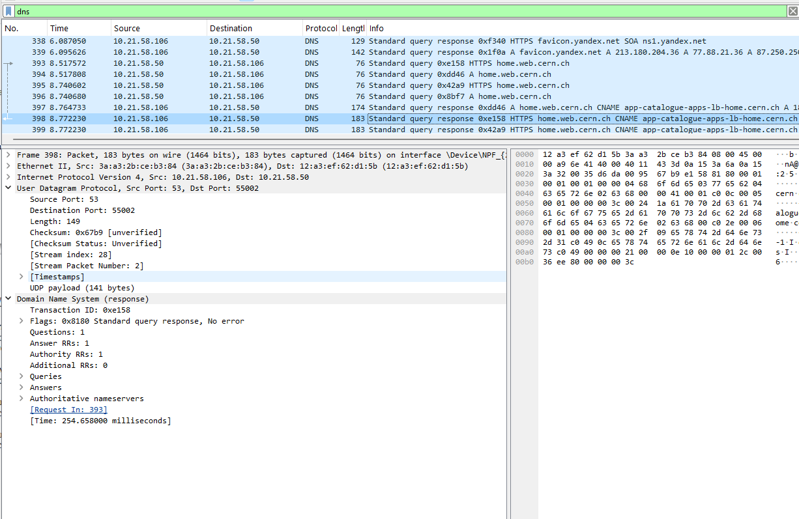{ #fig-014 width=70% }

После этого применяю фильтр `quic` для поиска трафика протокола QUIC. В выполненном захвате фильтр не отображает ни одного пакета. Следовательно, в рассматриваемом сеансе трафик, распознанный Wireshark как QUIC, отсутствует, и провести разбор заголовков QUIC по данному захвату невозможно (см. рис. [@fig-015]).

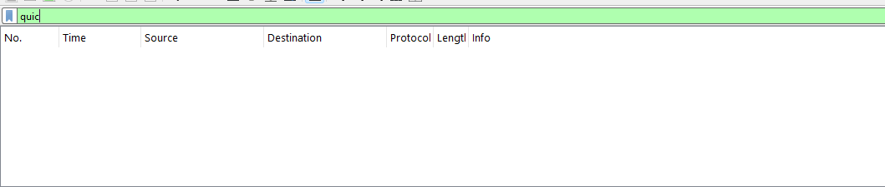{ #fig-015 width=70% }

Дополнительно проверяю защищённый трафик фильтром `tls`. В отличие от `quic`, здесь отображается большое количество пакетов. Видны соединения TLS с удалёнными узлами на порт `443`, включая `Client Hello` с именами серверов `sync.browser.yandex.net` и `info.cern.ch`, сообщения `Server Hello`, `Change Cipher Spec`, `Encrypted Handshake Message` и `Application Data`.

В выбранном соединении клиент `10.21.58.50` обращается к `188.184.67.127` через TCP-порт `443`. В заголовке TCP для выбранного сегмента указаны исходный порт `62156`, порт назначения `443`, флаги `PSH, ACK` и наличие TCP-полезной нагрузки. В разделе TLS отображается `Handshake Protocol: Client Hello`. Следовательно, защищённые соединения в данном захвате передавались через TLS поверх TCP, в то время как отдельных пакетов QUIC Wireshark не зарегистрировал (см. рис. [@fig-016]).

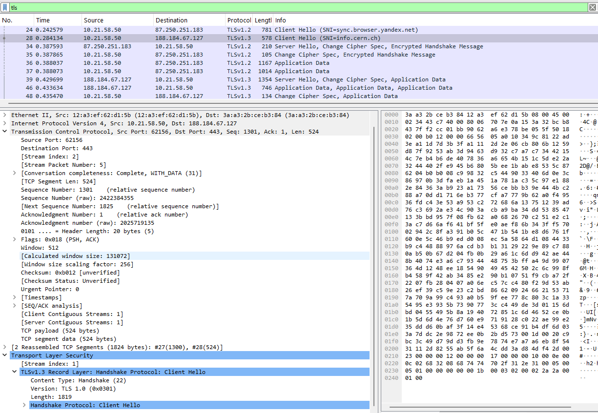{ #fig-016 width=70% }

## 11.3.4. Анализ handshake протокола TCP в Wireshark

Для анализа процесса установления TCP-соединения применяю фильтр `tcp`. В захвате присутствует соединение между локальным узлом `10.21.58.50` и HTTP-сервером `188.184.67.127`. Для рассмотрения трёхэтапного рукопожатия TCP использую соединение с клиентским портом `51410` и серверным портом `80`.

Первым этапом является кадр № 14, переданный от `10.21.58.50:51410` к `188.184.67.127:80`. Установлен только флаг `SYN`, в Wireshark отображается `[SYN] Seq=0 Win=64240 Len=0 MSS=1460 WS=256 SACK_PERM`. Относительный номер последовательности равен `0`, а подтверждение отсутствует. SYN используется клиентом для запроса установления соединения и синхронизации начальных номеров последовательности. Сам флаг SYN занимает одно значение в пространстве номеров последовательности, поэтому следующим относительным номером клиента становится `1`. Для выбранного сегмента Wireshark также показывает исходное абсолютное значение Sequence Number `4288130533`.

Вторым этапом является кадр № 16 от `188.184.67.127:80` к `10.21.58.50:51410`. Установлены флаги `SYN, ACK`. В списке пакетов отображается `[SYN, ACK] Seq=0 Ack=1 Win=64240 Len=0 MSS=1300 SACK_PERM WS=128`. Сервер устанавливает собственный начальный номер последовательности и одновременно подтверждает SYN клиента значением `Ack=1`.

Третьим этапом является кадр № 17 от клиента к серверу. Он содержит флаг `ACK` и значения `Seq=1 Ack=1`. Клиент подтверждает получение SYN сервера, после чего TCP-соединение считается установленным. Сразу после завершения handshake в кадре № 18 передаётся прикладной запрос `GET / HTTP/1.1`. В захвате также видно второе параллельное TCP-соединение с клиентским портом `52119`, для которого повторяется последовательность `SYN → SYN, ACK → ACK` (см. рис. [@fig-017]).

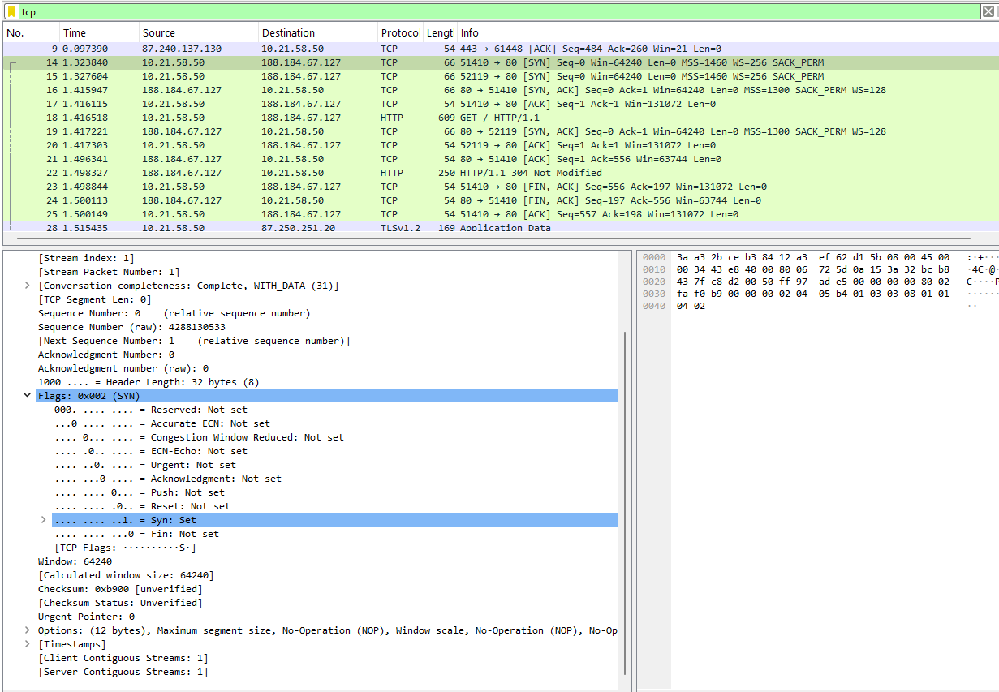{ #fig-017 width=70% }

Для графического анализа обмена открываю в Wireshark меню `Статистика` и выбираю `График потока`. На диаграмме отображаются участвующие узлы, направление сообщений и значения основных полей TCP.

Для соединения `10.21.58.50:51410 → 188.184.67.127:80` примерно в момент `1,323840` с клиентской стороны передаётся `SYN` с `Seq=0`. Примерно в момент `1,415947` сервер отправляет встречный `SYN, ACK` с `Seq=0` и `Ack=1`. Затем около `1,416115` клиент отправляет заключительный `ACK` с `Seq=1` и `Ack=1`. После завершения трёхэтапного рукопожатия на графике появляется `GET / HTTP/1.1`, то есть начинается передача данных прикладного уровня.

В дальнейшем сервер подтверждает принятые данные, после чего передаёт HTTP-ответ `HTTP/1.1 304 Not Modified`. На графике также видны сегменты `FIN, ACK`, используемые для завершения TCP-соединения. Следовательно, график потока позволяет наглядно проследить полный жизненный цикл TCP-сеанса: установление соединения с помощью `SYN → SYN, ACK → ACK`, передачу HTTP-данных с изменением `Seq` и `Ack`, подтверждение полученных байтов и последующее закрытие соединения посредством `FIN` и `ACK` (см. рис. [@fig-018]).

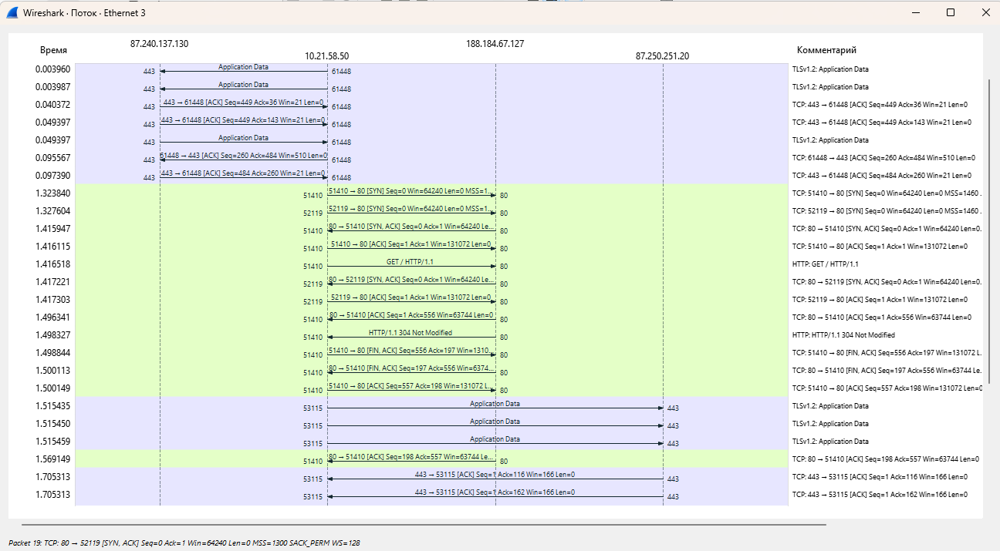{ #fig-018 width=70% }

# Вывод

В ходе лабораторной работы была изучена сетевая конфигурация компьютера с помощью команды `ipconfig`, определены IP- и MAC-адреса сетевых интерфейсов, а также рассмотрена структура и тип MAC-адресов. В программе Wireshark был выполнен захват и анализ кадров ARP и ICMP, исследованы HTTP- и DNS-запросы, особенности передачи данных по протоколам TCP и UDP, а также проверено наличие трафика QUIC. Дополнительно был рассмотрен процесс установления TCP-соединения и проанализирован трёхэтапный handshake `SYN → SYN, ACK → ACK` с помощью списка пакетов и графика потока.