---
## Author
author:
  name: Камбунду Паулине Де Лоурдеш Бранку
  email: 1032239159@rudn.ru
  affiliation:
    - name: Российский университет дружбы народов
      country: Российская Федерация
      postal-code: 117198
      city: Москва
      address: ул. Миклухо-Маклая, д. 6

## Title
title: "Отчёт по лабораторной работе №2"
subtitle: "Простые сети в GNS3. Анализ трафика"
license: "CC BY"
---

# Цель работы

Построение простейших моделей сети на базе коммутатора и маршрутизаторов FRR и VyOS в GNS3, анализ трафика посредством Wireshark.

# Выполнение лабораторной работы

В GNS3 создаю проект для моделирования простейшей локальной сети на базе Ethernet-коммутатора. В рабочей области размещаю два оконечных устройства VPCS и коммутатор Ethernet. Устройствам присваиваю имена `PC1-paulinelourdes`, `PC2-paulinelourdes` и `msk-paulinelourdes-sw-01`. Оба компьютера соединяю с коммутатором, формируя единый широковещательный сегмент сети. Построенная топология предназначена для проверки обмена данными между двумя узлами одной подсети `192.168.1.0/24` (см. рис. [@fig-001]).

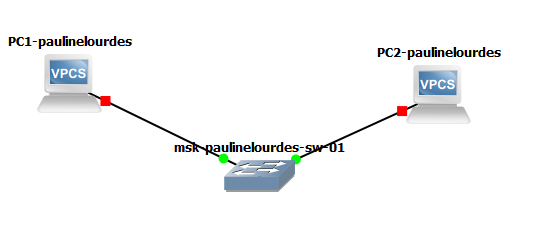{ #fig-001 width=70% }

После запуска оконечных устройств открываю консоль VPCS. Для ознакомления с доступными командами выполняю команду `?`. В справочной информации отображаются команды управления VPCS, среди которых `ip` для настройки сетевых параметров, `ping` для проверки соединения, `show` для просмотра текущей конфигурации и `save` для сохранения настроек. Также доступны команды просмотра ARP-таблицы, трассировки маршрута и управления DHCP (см. рис. [@fig-002]).

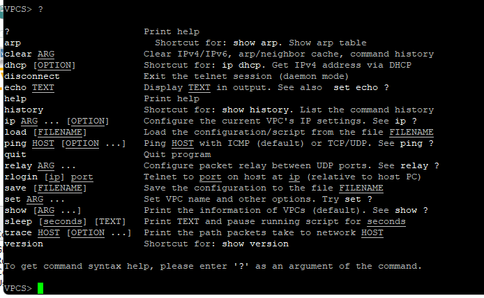{ #fig-002 width=70% }

Настраиваю IP-адреса оконечных устройств в сети `192.168.1.0/24`. Для `PC1-paulinelourdes` задаю адрес `192.168.1.11/24` и шлюз `192.168.1.1` командой:

`ip 192.168.1.11/24 192.168.1.1`

Для `PC2-paulinelourdes` аналогично задаю адрес `192.168.1.12/24` и тот же адрес шлюза:

`ip 192.168.1.12/24 192.168.1.1`

После настройки на каждом узле выполняю команду `save`, которая сохраняет конфигурацию в файл `startup.vpc`.

Работоспособность созданной сети проверяю с помощью команды `ping`. С узла `PC1-paulinelourdes` отправляются ICMP-запросы на адрес `192.168.1.12`, а с `PC2-paulinelourdes` — на адрес `192.168.1.11`. В обоих случаях получены ответы на все пять отправленных запросов. Значение `ttl=64` показывает значение поля TTL в принятых IP-пакетах, а время ответа составляет несколько миллисекунд. Успешный двусторонний обмен ICMP-пакетами подтверждает корректную настройку адресации и работоспособность соединения через Ethernet-коммутатор (см. рис. [@fig-003]).

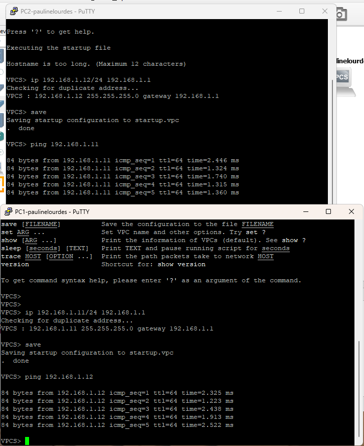{ #fig-003 width=70% }

Для анализа сетевого трафика запускаю Wireshark на соединении между `PC1-paulinelourdes` и коммутатором `msk-paulinelourdes-sw-01`. В GNS3 активный захват трафика обозначается значком лупы на соответствующем соединении. После запуска всех устройств индикаторы соединений становятся зелёными, что свидетельствует об активном состоянии сетевых интерфейсов (см. рис. [@fig-004]).

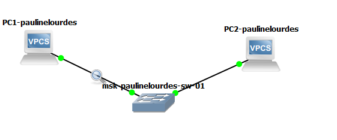{ #fig-004 width=70% }

После запуска узлов Wireshark фиксирует ARP-сообщения. В захвате присутствуют широковещательные Gratuitous ARP-запросы для адресов `192.168.1.11` и `192.168.1.12`. Ethernet-кадры направляются на широковещательный MAC-адрес `ff:ff:ff:ff:ff:ff`.

Gratuitous ARP используется узлом для объявления собственного соответствия IP- и MAC-адресов, а также позволяет обнаруживать возможное дублирование IP-адреса в локальном сегменте. В выбранном пакете для `192.168.1.12` поле `Sender IP address` содержит `192.168.1.12`, поле `Target IP address` также содержит `192.168.1.12`, а MAC-адрес отправителя равен `00:50:79:66:68:01`. Значение `Opcode: request (1)` показывает, что пакет является ARP-запросом. Помимо ARP, в начале захвата присутствуют служебные ICMPv6 Router Solicitation, не влияющие на проверяемый IPv4-обмен (см. рис. [@fig-005]).

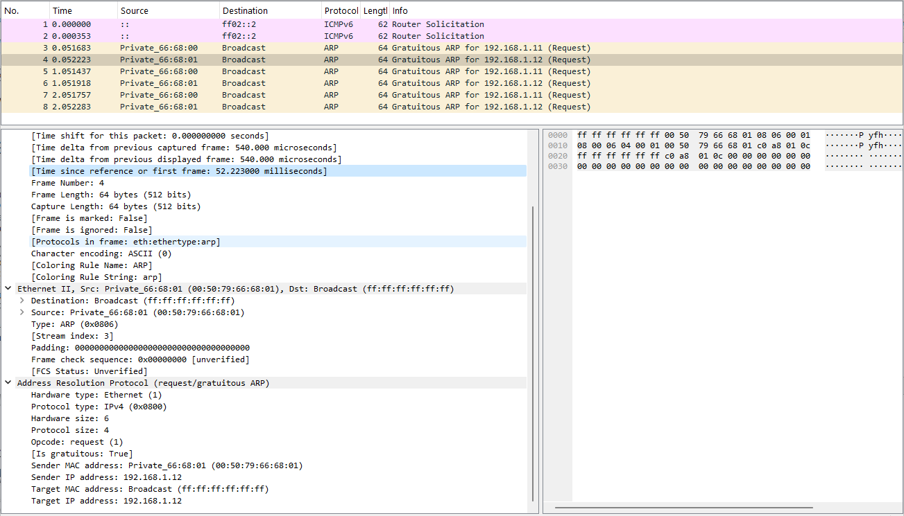{ #fig-005 width=70% }

Перед выполнением различных вариантов проверки соединения просматриваю справку команды `ping` с помощью `ping ?`. VPCS позволяет использовать несколько режимов проверки. Параметр `-1` соответствует стандартному ICMP-режиму, `-2` — UDP-режиму, а `-3` — TCP-режиму. Параметр `-c` задаёт количество отправляемых пакетов. Это позволяет выполнить по одному запросу каждого типа и отдельно проанализировать соответствующий обмен в Wireshark (см. рис. [@fig-006]).

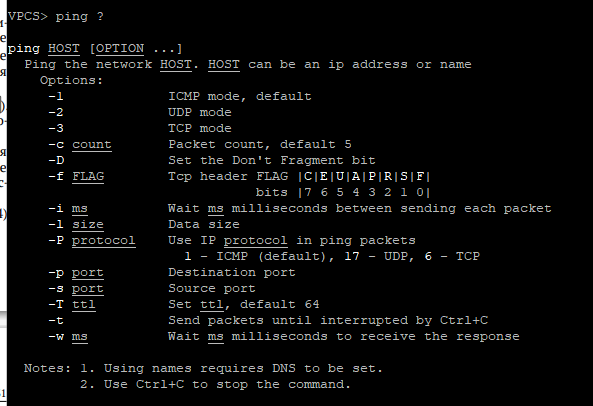{ #fig-006 width=70% }

С узла `PC2-paulinelourdes` выполняю один запрос к `PC1-paulinelourdes` в ICMP-режиме командой:

`ping 192.168.1.11 -c 1 -1`

В ответ получен один пакет от узла `192.168.1.11`. В терминале отображается `icmp_seq=1`, значение `ttl=64` и время ответа около `1.443 ms`, что подтверждает успешную передачу ICMP Echo Request и получение ICMP Echo Reply (см. рис. [@fig-007]).

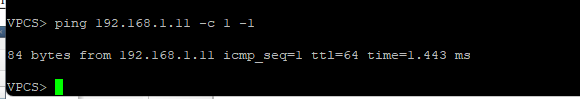{ #fig-007 width=70% }

В Wireshark перед непосредственным ICMP-обменом видны ARP-запрос и ARP-ответ. Узел `192.168.1.12` передаёт широковещательный запрос `Who has 192.168.1.11? Tell 192.168.1.12`, выясняя MAC-адрес получателя. Узел `192.168.1.11` отвечает сообщением `192.168.1.11 is at 00:50:79:66:68:00`.

После разрешения адреса передаётся ICMP Echo Request от `192.168.1.12` к `192.168.1.11`, после чего приходит Echo Reply в обратном направлении. У выбранного ICMP-запроса поле `Type` равно `8`, поле `Code` равно `0`, IP-адрес источника — `192.168.1.12`, адрес назначения — `192.168.1.11`, а значение `Time to Live` равно `64`. Размер IP-пакета составляет `84` байта, а весь Ethernet-кадр — `98` байт. Ответный пакет связан с запросом непосредственно средствами Wireshark, что позволяет сопоставить пару Echo Request/Echo Reply (см. рис. [@fig-008]).

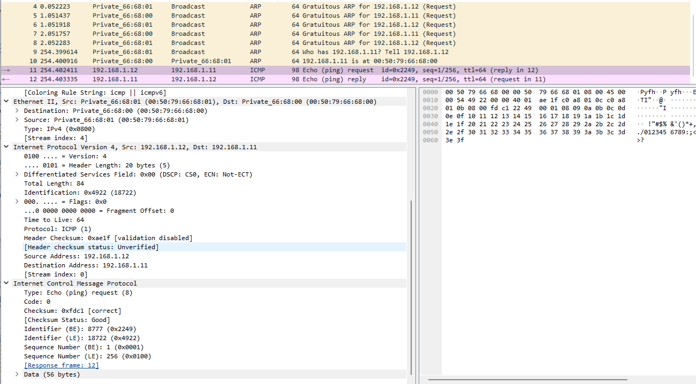{ #fig-008 width=70% }

Далее выполняю проверку соединения в UDP-режиме. Для отправки одного запроса использую команду:

`ping 192.168.1.11 -c 1 -2`

В результате VPCS получает ответ от `192.168.1.11`. В выводе указаны `udp_seq=1`, `ttl=64` и время ответа около `1.143 ms`, следовательно, UDP-обмен между двумя оконечными устройствами выполняется успешно (см. рис. [@fig-009]).

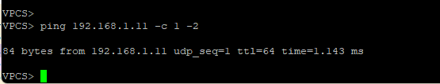{ #fig-009 width=70% }

В Wireshark UDP-проверка представлена двумя сообщениями, декодированными как `ECHO`: запросом от `192.168.1.12` к `192.168.1.11` и ответом в обратном направлении. В заголовке IPv4 поле `Protocol` имеет значение `UDP (17)`. Для выбранного пакета исходным UDP-портом является `53088`, а портом назначения — `7`. Порт `7` традиционно используется службой Echo и применяется VPCS для данного режима проверки. Длина UDP-дейтаграммы составляет `64` байта, включая `56` байт полезной нагрузки. В отличие от ICMP, здесь проверка выполняется средствами транспортного протокола UDP, который не устанавливает предварительное соединение между узлами (см. рис. [@fig-010]).

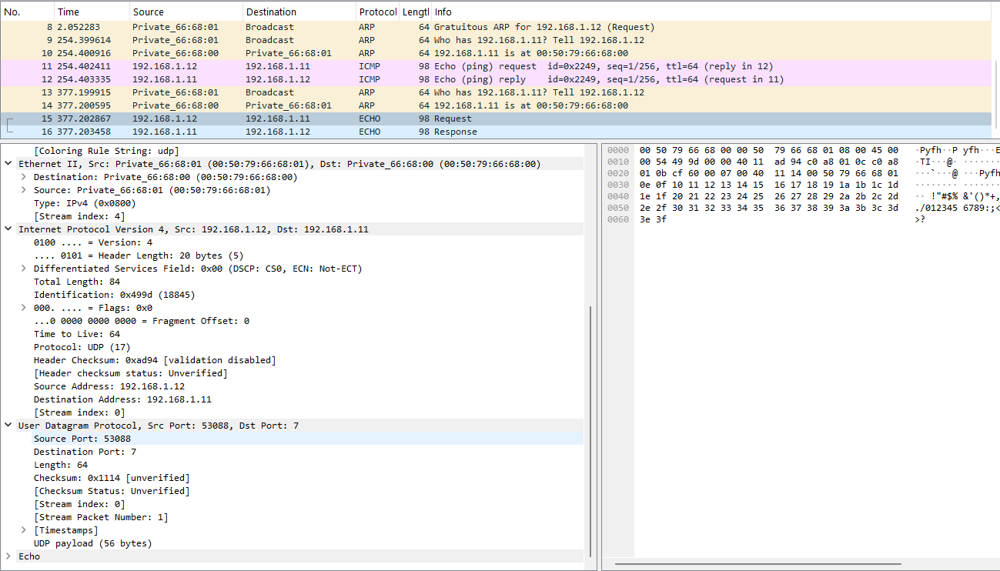{ #fig-010 width=70% }

После UDP-проверки выполняю один запрос в TCP-режиме:

`ping 192.168.1.11 -c 1 -3`

В терминале VPCS отображаются этапы `Connect`, `SendData` и `Close` для порта `7` узла `192.168.1.11`. Это указывает на установление TCP-соединения, передачу данных и последующее его завершение. Для каждого этапа также выводится время выполнения операции (см. рис. [@fig-011]).

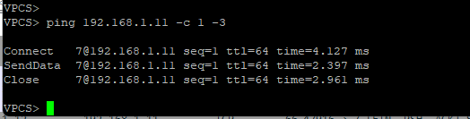{ #fig-011 width=70% }

Захват Wireshark показывает характерную для TCP последовательность обмена. Сначала узел `192.168.1.12` отправляет на порт `7` узла `192.168.1.11` сегмент с флагом `SYN`. В ответ приходит `SYN, ACK`, после чего отправитель передаёт `ACK`, завершая трёхэтапное установление TCP-соединения.

После установления соединения выполняется передача Echo-данных. В выбранном TCP-сегменте исходным портом является `47916`, портом назначения — `7`, а размер полезной нагрузки TCP составляет `56` байт. После обмена данными в захвате присутствуют сегменты с флагами `FIN` и `ACK`, отвечающие за корректное завершение соединения. TCP-проверка отличается от ICMP- и UDP-проверок необходимостью предварительного установления логического соединения и подтверждения передаваемых данных (см. рис. [@fig-012]).

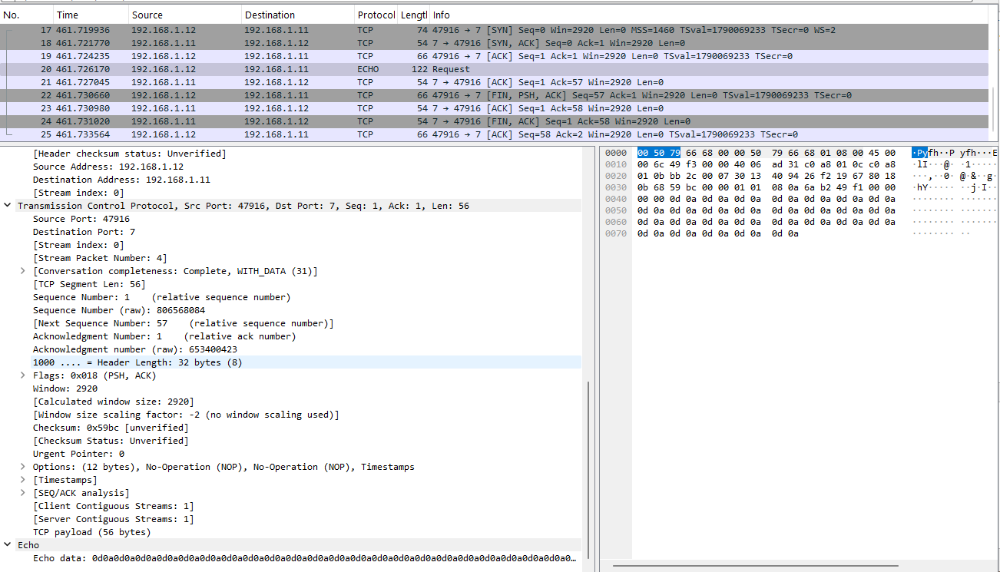{ #fig-012 width=70% }

После завершения анализа трафика останавливаю захват пакетов Wireshark и перехожу к моделированию сети на базе маршрутизатора FRR.

В новом проекте GNS3 размещаю оконечное устройство VPCS, Ethernet-коммутатор и маршрутизатор FRR. Узел получает имя `PC1-paulinelourdes`, коммутатор — `msk-paulinelourdes-sw-01`, а маршрутизатор — `msk-paulinelourdes-gw-01`. PC1 подключаю к коммутатору, а коммутатор — к интерфейсу маршрутизатора. На соединении между коммутатором и FRR включаю захват трафика, что отображается значком лупы (см. рис. [@fig-013]).

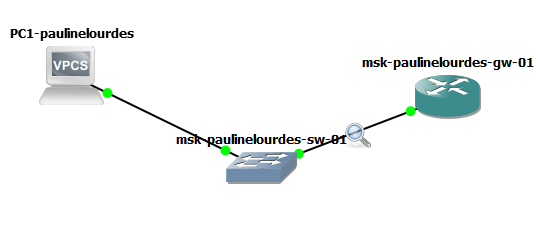{ #fig-013 width=70% }

Настраиваю маршрутизатор FRR через его консоль. После входа в CLI перехожу в режим конфигурирования командой `configure terminal` и изменяю имя устройства:

`hostname msk-paulinelourdes-gw-01`

После выхода из режима конфигурирования выполняю `write memory`. FRR сообщает о сохранении интегрированной конфигурации в файл `/etc/frr/frr.conf`.

Затем вновь перехожу в режим конфигурирования и выбираю интерфейс `eth0` командой `interface eth0`. Интерфейсу присваиваю адрес:

`ip address 192.168.1.1/24`

Командой `no shutdown` перевожу интерфейс в рабочее состояние. После выхода из режимов настройки снова выполняю `write memory`, сохраняя внесённые изменения. Сообщение `[OK]` подтверждает успешную запись конфигурации (см. рис. [@fig-014]).

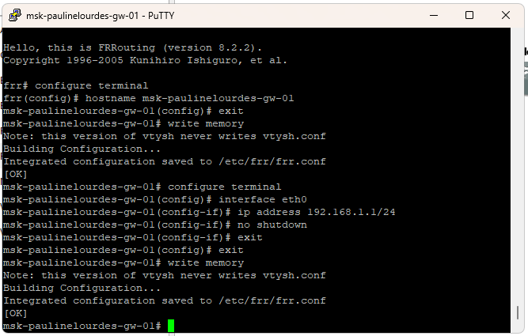{ #fig-014 width=70% }

Для проверки параметров FRR выполняю команды `show running-config` и `show interface brief`. В текущей конфигурации отображается имя `msk-paulinelourdes-gw-01`, а для интерфейса `eth0` указан адрес `192.168.1.1/24`.

В краткой таблице интерфейсов `eth0` имеет состояние `up` и адрес `192.168.1.1/24`. Остальные физические интерфейсы `eth1`–`eth7` находятся в состоянии `down`, поскольку в созданной топологии они не используются. Полученная информация подтверждает, что интерфейс локальной сети FRR настроен и активен (см. рис. [@fig-015]).

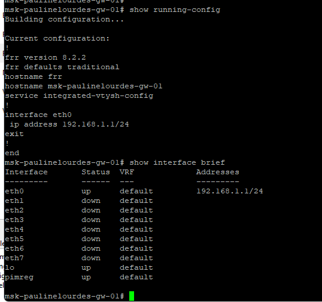{ #fig-015 width=70% }

На узле `PC1-paulinelourdes` задаю IP-адрес `192.168.1.10/24` и шлюз `192.168.1.1`, после чего сохраняю конфигурацию командой `save`. Команда `show ip` показывает адрес `192.168.1.10/24`, шлюз `192.168.1.1` и MAC-адрес интерфейса `00:50:79:66:68:00`.

Для проверки доступности маршрутизатора выполняю:

`ping 192.168.1.1`

От маршрутизатора получены ответы на все пять ICMP-запросов. Значение `ttl=64` сохраняется для каждого ответа, а время прохождения пакетов находится в диапазоне нескольких миллисекунд. Потерь пакетов не наблюдается, поэтому сетевое взаимодействие между VPCS и интерфейсом FRR настроено корректно (см. рис. [@fig-016]).

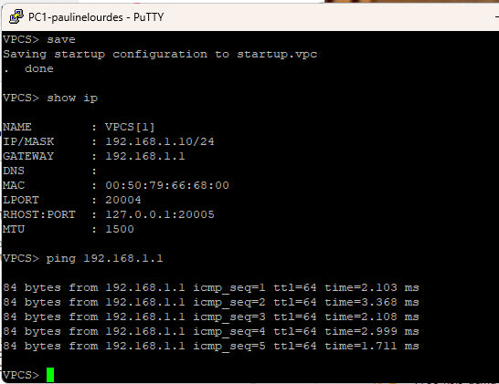{ #fig-016 width=70% }

Одновременно анализирую обмен в Wireshark на соединении между коммутатором и маршрутизатором. В списке пакетов видны последовательные ICMP Echo Request от `192.168.1.10` к `192.168.1.1` и соответствующие Echo Reply от `192.168.1.1` к `192.168.1.10`.

В выбранном запросе IPv4-адресом источника является `192.168.1.10`, адресом назначения — `192.168.1.1`, поле `Protocol` имеет значение `ICMP (1)`, а `TTL` равно `64`. В заголовке ICMP указан тип `Echo (ping) request (8)` и код `0`. Wireshark связывает каждый запрос с соответствующим ответом. Наличие всех пар Echo Request/Echo Reply подтверждает корректную работу интерфейса `eth0` маршрутизатора FRR и доступность адреса `192.168.1.1` из локальной сети (см. рис. [@fig-017]).

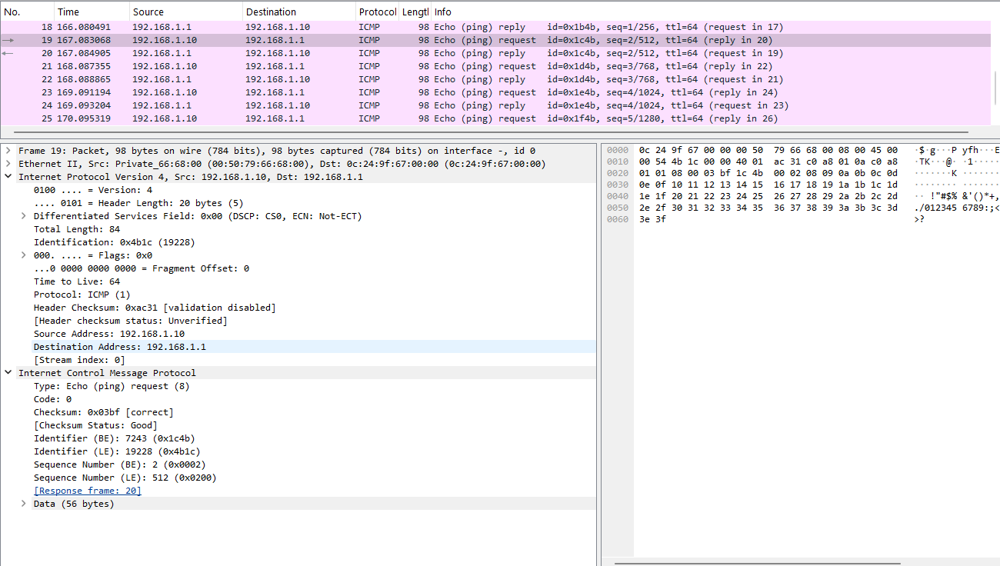{ #fig-017 width=70% }

После проверки FRR останавливаю захват пакетов и устройства проекта. Далее создаю топологию для работы с маршрутизатором VyOS. В рабочей области размещаю `PC1-paulinelourdes`, Ethernet-коммутатор `msk-paulinelourdes-sw-01` и виртуальный маршрутизатор VyOS. Оконечный узел соединяю с коммутатором, а коммутатор — с маршрутизатором. На соединении между коммутатором и VyOS запускаю захват трафика для последующего анализа обмена в Wireshark (см. рис. [@fig-018]).

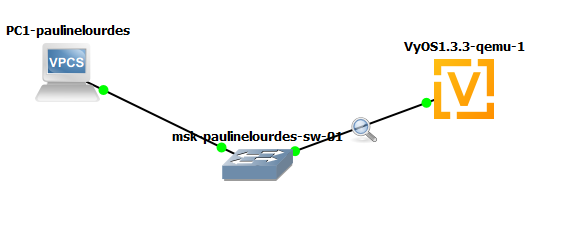{ #fig-018 width=70% }

После загрузки VyOS вхожу в систему и командой `configure` перехожу в режим конфигурирования. Имя маршрутизатора задаю командой:

`set system host-name msk-paulinelourdes-gw-01`

Поскольку интерфейс `eth0` изначально содержит настройку автоматического получения адреса, удаляю DHCP-конфигурацию:

`delete interfaces ethernet eth0 address dhcp`

После этого назначаю интерфейсу статический IPv4-адрес:

`set interfaces ethernet eth0 address 192.168.1.1/24`

Команда `compare` отображает неподтверждённые изменения: строка `address dhcp` удаляется, добавляется `address 192.168.1.1/24`, а системное имя заменяется на `msk-paulinelourdes-gw-01`. Для применения конфигурации выполняю `commit`, после чего сохраняю её командой `save`. VyOS сообщает о сохранении настроек в файл `/config/config.boot` и выводит `Done`, подтверждая успешную запись конфигурации (см. рис. [@fig-019]).

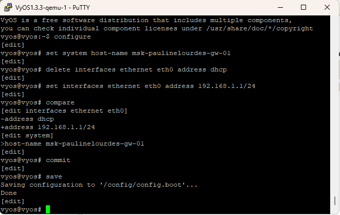{ #fig-019 width=70% }

Командой `show interfaces` проверяю параметры сетевых интерфейсов VyOS. Для `ethernet eth0` указан адрес `192.168.1.1/24` и аппаратный MAC-адрес `0c:73:04:8f:00:00`. Интерфейсы `eth1` и `eth2` IP-адресов не имеют и в данной топологии не используются. Вывод команды подтверждает успешное назначение требуемого IPv4-адреса интерфейсу локальной сети маршрутизатора (см. рис. [@fig-020]).

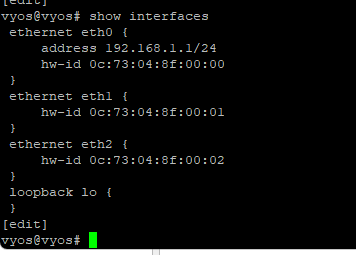{ #fig-020 width=70% }

На `PC1-paulinelourdes` настраиваю адрес `192.168.1.10/24` со шлюзом `192.168.1.1`. Команда `show ip` подтверждает заданные параметры: IP-адрес узла — `192.168.1.10/24`, шлюз — `192.168.1.1`, MAC-адрес — `00:50:79:66:68:00`.

После настройки выполняю команду `ping 192.168.1.1`. В консоли получены пять ответов от маршрутизатора. Для каждого ответа указано `ttl=64`, а время находится приблизительно в диапазоне от `1.7` до `4.2 ms`. Все запросы получили ответы, что подтверждает работоспособность соединения между `PC1-paulinelourdes` и маршрутизатором VyOS (см. рис. [@fig-021]).

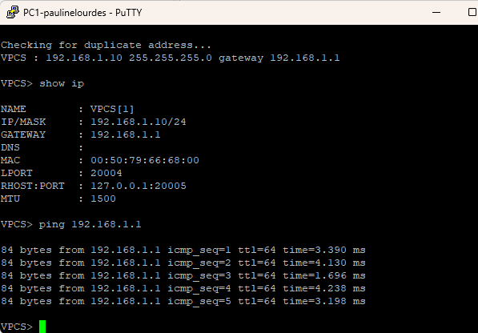{ #fig-021 width=70% }

В Wireshark наблюдаю ICMP-пакеты, проходящие по соединению между коммутатором и VyOS. В захвате присутствуют пары Echo Request от `192.168.1.10` к `192.168.1.1` и Echo Reply от `192.168.1.1` к `192.168.1.10`.

Для выбранного ответного пакета источником является `192.168.1.1`, а получателем — `192.168.1.10`. В IPv4-заголовке значение `TTL` равно `64`, поле протокола содержит `ICMP (1)`. В заголовке ICMP указан тип `Echo (ping) reply (0)` и код `0`. Wireshark связывает ответ с соответствующим запросом и показывает время ответа около `3.249 ms`. Последовательное получение всех Echo Reply подтверждает корректную работу настроенного интерфейса `eth0` маршрутизатора VyOS и передачу трафика между оконечным устройством и шлюзом (см. рис. [@fig-022]).

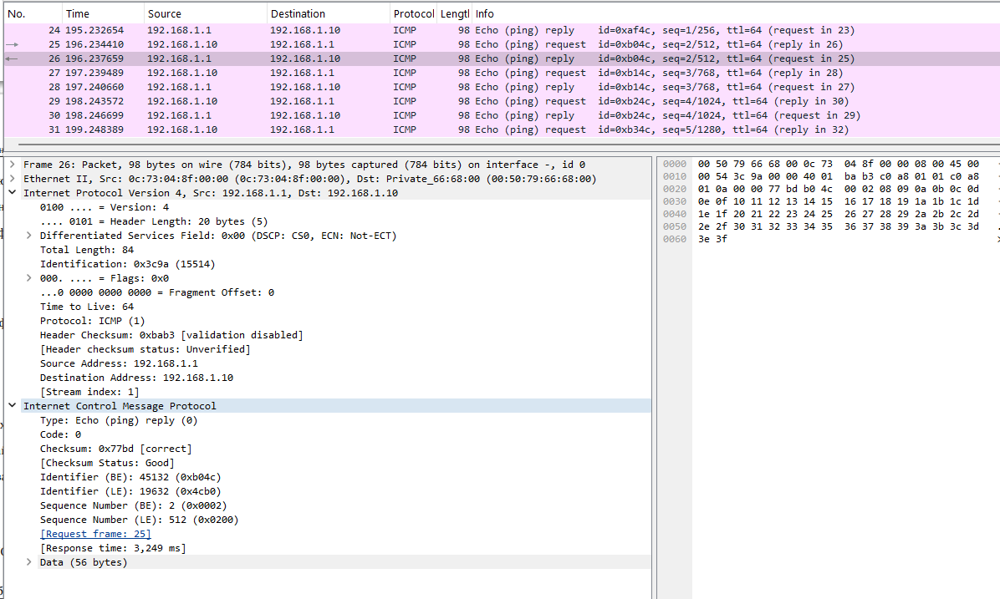{ #fig-022 width=70% }

После завершения проверки останавливаю захват пакетов в Wireshark и останавливаю все устройства проекта GNS3. В ходе работы были построены простейшая коммутируемая сеть и две сети с маршрутизаторами FRR и VyOS, настроена IPv4-адресация и проверена доступность узлов. При помощи Wireshark были исследованы ARP-сообщения, стандартный ICMP-обмен, UDP Echo и TCP Echo, а также ICMP-трафик между оконечным устройством и маршрутизаторами.

# Вывод

В ходе лабораторной работы были построены и настроены простые сети в GNS3 на базе Ethernet-коммутатора, маршрутизатора FRR и маршрутизатора VyOS. Была выполнена настройка IPv4-адресации и проверена связность между сетевыми устройствами. С помощью Wireshark проведён захват и анализ ARP, ICMP, UDP и TCP-трафика, что позволило изучить процессы разрешения адресов, проверки доступности узлов и передачи данных по различным сетевым протоколам.